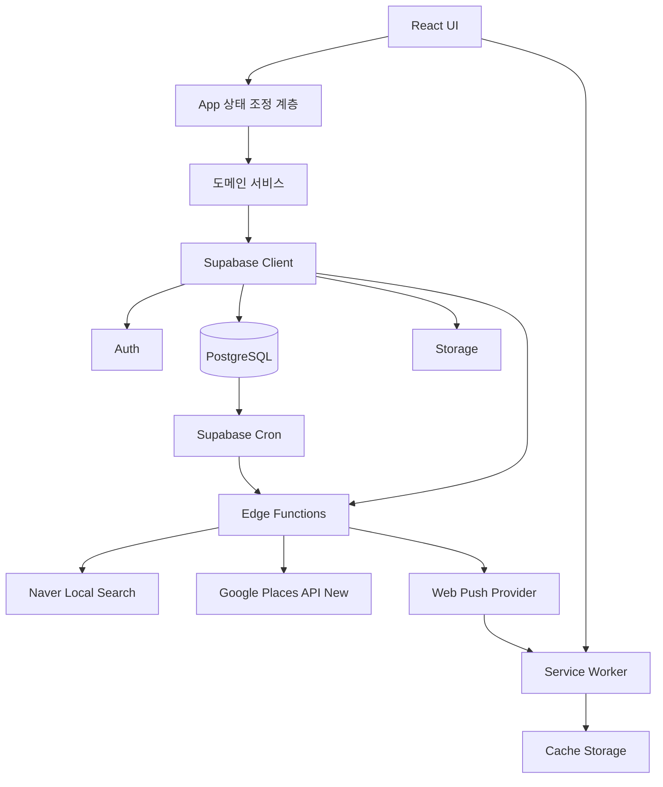
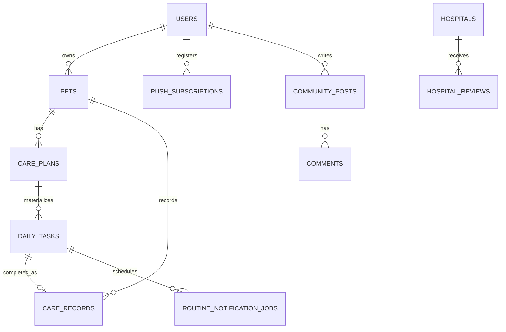
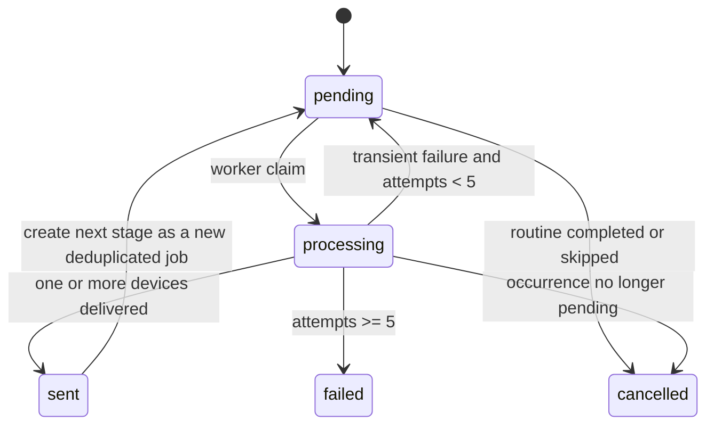
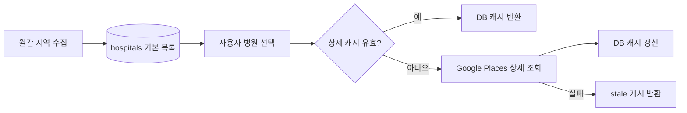
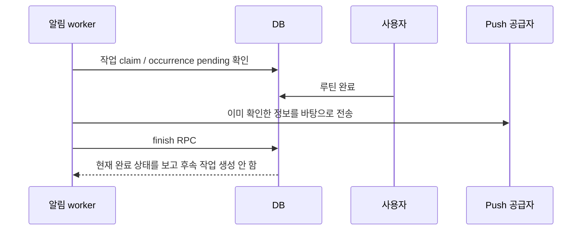

# 파작파작(ExoCare) 핵심 알고리즘과 설계 해설

> 대상 프로젝트: 특수동물 케어 PWA  
> 기술 스택: React 19, TypeScript 6, Vite 8, Supabase(PostgreSQL/Auth/Storage/Edge Functions), Web Push, Service Worker, Naver Maps, Google Places API(New)  
> 목적: 코드를 단순히 소개하는 수준을 넘어, 면접에서 설계 의도·알고리즘·정합성·동시성·실패 대응·개선 방향까지 설명할 수 있도록 정리한 기술 문서

> 분석 기준: 2026-09-19 작업 디렉터리의 실제 소스와 SQL 마이그레이션. 미커밋 변경을 포함한다. 배포 DB에 모든 마이그레이션이 적용됐는지, 외부 API와 푸시가 운영에서 성공하는지는 별도 검증 대상이다. 이 문서는 성능 실측 보고서나 의료 지침이 아니라 **소스 분석 기반 기술 사례 연구**다.
>
> 예제 표기: 기존 1~23장의 코드는 설명을 위해 줄바꿈·타입·오류 처리를 일부 생략한 발췌 또는 축약이다. `...`가 있는 SQL은 직접 실행하지 않는다. 뒤의 심화 장에서는 실제 발췌, 설명용 예제, 개선 제안을 구분한다. 구현에서 유추한 설계 이유는 원저자의 실제 의사결정 기록으로 단정하지 않는다.

### 읽기 안내와 전체 목차

| 범위 | 주제 | 준비 목표 |
|---|---|---|
| 0~4장 | 아키텍처·반복 일정·원자적 완료·주기 분석 | 데이터 모델과 수식 설명 |
| 5~8장 | 알림 큐·브라우저 구독·병원 검색·종 매칭 | 시스템 간 상태와 캐시 설명 |
| 9~14장 | 로컬 병합·Q&A·이미지·인증·PWA·호환 계층 | 실패 대응과 신뢰 경계 설명 |
| 15~23장 | 동시성 패턴·복잡도·테스트·발표·질문 | 면접 답변의 기본 골격 |
| 24장 | 분석 방법과 요구사항/구현의 차이 | 구현 여부 과장 방지 |
| 25장 | 반복 일정 SQL과 밀린 루틴 압축 | 불변식·경계 조건·복잡도 심화 |
| 26장 | 알림의 분산 시스템 한계 | exactly-once 반론에 답하기 |
| 27장 | 진료·리뷰·복약 연동과 날짜 오류 | 여러 테이블의 부분 실패 분석 |
| 28장 | 병원 매칭·근거 순위·요청 공유 | 검색과 추천을 구분하기 |
| 29장 | NOTICE 규칙·통계·차트 | 규칙 엔진과 데이터 의미 설명 |
| 30장 | React 상태·드래그·URL·비동기 | 프론트엔드 구현 난도 설명 |
| 31장 | 좋아요·스냅샷·RLS·신고 | 인증과 권한, 캐시 예외 설명 |
| 32장 | 이미지·OCR·PWA 심화 | 보안/신뢰 경계와 자원 관리 |
| 33장 | 검증 행렬과 실험 설계 | 테스트와 실측을 구별하기 |
| 34장 | 심화 면접 질문·설계 대안 | 트레이드오프와 개선 우선순위 |
| 35장 | 발표 대본·용어집·읽기 색인 | 실제 면접 직전 복습 |

**면접에서 먼저 정정할 세 가지:** 현재 지도 컴포넌트는 Naver SDK를 사용하며 Google Maps JavaScript API 전환 요구사항과 차이가 있다. 푸시는 중복 억제 장치를 갖췄지만 exactly-once나 엄밀한 at-most-once를 보장하지 않는다. 모든 저장이 원자적인 것이 아니라 특정 완료 RPC 경로가 원자적이다.

---

## 0. 초록

파작파작은 파충류·양서류 등 특수동물의 반복 돌봄, 일일 기록, 병원 탐색, 사용자 질문을 하나의 데이터 흐름으로 연결하는 PWA다. 표면적으로는 CRUD 중심 애플리케이션처럼 보이지만, 실제 난이도는 다음 문제에서 발생한다.

1. 반복 규칙인 `care_plans`를 날짜별 실행 단위인 `daily_tasks`로 안전하게 구체화해야 한다.
2. 사용자가 루틴을 완료했을 때 일일 작업 상태와 캘린더 기록이 서로 어긋나면 안 된다.
3. 푸시 알림은 여러 실행기가 동시에 작동해도 중복 발송되지 않아야 하며, 전송 성공 후 DB 갱신 실패 같은 부분 실패도 다뤄야 한다.
4. 병원 기본 정보, 외부 Places 상세 정보, 앱 내부 리뷰는 갱신 주기와 신뢰 수준이 서로 다르므로 하나의 캐시 정책으로 처리할 수 없다.
5. 네트워크 장애 상황에서도 임시 저장과 읽기 경험을 유지하되, 서버 데이터를 진실의 원천으로 삼아야 한다.
6. Q&A의 첨부 기록은 원본 기록이 나중에 바뀌더라도 질문 작성 당시의 맥락을 보존해야 한다.

이 프로젝트는 이 문제들을 **반복 규칙과 발생 건의 분리**, **DB 함수 기반 원자적 상태 전이**, **중복 제거 키와 행 잠금 기반 작업 큐**, **데이터 종류별 TTL**, **서버 우선 병합**, **스냅샷 저장**으로 해결한다.

---

## 1. 시스템 구조

### 1.1 논리 아키텍처



React 컴포넌트는 화면 상태와 사용자 입력을 담당하고, 데이터 정합성이 중요한 작업은 `diaryService.ts`, PostgreSQL RPC, Edge Function으로 내려간다. 서비스 역할 키와 서버 API 비밀키는 Edge Function 환경변수에 둔다. 브라우저 지도 SDK 식별자, Supabase 공개 클라이언트 키, VAPID 공개키는 공개될 수 있는 설정이므로 서버 비밀키와 구분한다.

### 1.2 주요 계층과 책임

| 계층 | 대표 파일 | 책임 |
|---|---|---|
| 앱 조정 | `src/App.tsx` | 인증 세션, 탭, 기능 간 이동, 서버·로컬 데이터 병합 |
| 루틴 도메인 | `src/features/diary/routineSchedule.ts` | 반복 일정 판정, 물질화 전 화면 보완 |
| 다이어리 서비스 | `src/features/diary/diaryService.ts` | 루틴·발생 건·기록 저장, 완료/취소/건너뛰기 |
| 알림 클라이언트 | `src/lib/pushNotifications.ts` | 브라우저 구독과 DB 구독 상태 조정 |
| 알림 서버 | `supabase/functions/send-routine-notifications/index.ts` | 작업 claim, 푸시 전송, 재시도와 후속 알림 생성 |
| 병원 상세 서버 | `supabase/functions/search-reptile-amphibian-places/index.ts` | Places 조회, 후보 점수화, 캐시와 stale fallback |
| 병원 수집 서버 | `supabase/functions/refresh-hospital-catalog/index.ts` | 지역별 월간 수집과 상세 정보 점진 갱신 |
| 이미지 안전 처리 | `src/lib/imageStorage.ts` | 형식·크기 검증, 픽셀 재인코딩, Storage 업로드 |
| Q&A 안전·신뢰 | `src/lib/qnaModeration.ts`, `src/components/qna/qnaTrust.ts` | 욕설 마스킹, 기기 식별, 활동 기반 신뢰 점수 |

### 1.3 핵심 데이터 모델



가장 중요한 구분은 `care_plans`와 `daily_tasks`다.

- `care_plans`: “월·수·금 09:00에 먹이 주기” 같은 반복 규칙 원본이다.
- `daily_tasks`: “2026-09-19의 먹이 주기” 같은 날짜별 발생 건이다.
- `care_records`: 사용자가 실제로 수행했거나 직접 입력한 관찰 기록이다.

반복 규칙과 실행 상태를 한 행에 섞지 않았기 때문에 과거 완료 여부, 오늘의 미완료, 미래 일정이 서로 오염되지 않는다.

---

## 2. 반복 루틴 발생 알고리즘

관련 코드: `src/features/diary/routineSchedule.ts`

### 2.1 문제 정의

입력은 다음 두 종류다.

- 요일 반복: 매주 월·수·금
- 간격 반복: 시작일로부터 3일마다

날짜 `d`에 루틴 `p`가 발생하는지를 판정해야 한다. 비활성 상태, 시작일 전, 종료일 후에는 항상 거짓이어야 한다.

### 2.2 실제 판정 코드

```ts
export function carePlanOccursOn(plan: CarePlan, date: string) {
  if (!plan.isActive || date < plan.startDate ||
      (plan.endDate && date > plan.endDate)) return false

  if (plan.recurrenceType === 'interval') {
    const elapsed = Math.round(
      (Date.parse(date) - Date.parse(plan.startDate)) / 86400000
    )
    return elapsed >= 0 &&
      elapsed % Math.max(1, plan.recurrenceIntervalDays ?? 1) === 0
  }

  return plan.repeatDays.includes(
    new Date(`${date}T00:00:00Z`).getUTCDay()
  )
}
```

간격 반복은 다음 합동식으로 표현할 수 있다.

\[
occurs(p,d) = active(p) \land d \in [start,end] \land
((d-start) \bmod interval = 0)
\]

요일 반복은 날짜를 UTC 자정으로 고정한 뒤 `0=일요일 ... 6=토요일` 값이 `repeatDays`에 포함되는지 본다. 날짜 문자열을 그대로 비교하는 부분은 `YYYY-MM-DD`가 사전식 순서와 시간 순서가 같다는 성질을 이용한다.

### 2.3 시간복잡도

- 간격 반복 판정: `O(1)`
- 요일 배열 조회: 현재 배열 길이가 최대 7이므로 실질적으로 `O(1)`
- 펫 한 마리의 하루 요약: 작업 수를 `T`, 계획 수를 `P`라 할 때 `O(T + P)`

### 2.4 물질화 지연을 숨기는 화면 보완

DB가 날짜별 `daily_tasks`를 아직 생성하지 못했더라도 저장된 일정이 화면에서 사라지면 안 된다.

```ts
export function petRoutineSummary(
  petId: string,
  date: string,
  tasks: DailyTask[],
  plans: CarePlan[],
) {
  const todayTasks = tasks.filter(
    task => task.petId === petId && task.scheduledDate === date
  )
  const planMap = new Map(plans.map(plan => [plan.id, plan]))
  const materialized = new Set(todayTasks.map(task => task.carePlanId))

  return [
    ...todayTasks.map(task => ({
      id: task.id,
      taskType: task.taskType,
      status: task.status,
      title: task.carePlanId
        ? planMap.get(task.carePlanId)?.title
        : undefined,
    })),
    ...plans
      .filter(plan =>
        plan.petId === petId &&
        !materialized.has(plan.id) &&
        carePlanOccursOn(plan, date)
      )
      .map(plan => ({
        id: `schedule:${plan.id}`,
        taskType: plan.taskType,
        status: 'pending' as const,
        title: plan.title,
      })),
  ]
}
```

여기서 `Set`을 사용하지 않고 계획마다 `todayTasks.some(...)`을 실행하면 최악의 경우 `O(P×T)`가 된다. 현재 구현은 이미 물질화된 계획 ID를 `Set`에 넣어 평균 `O(1)` 조회로 바꿨다.

가상 ID `schedule:<planId>`는 화면 표시용일 뿐 완료 API에 전달하지 않는다. 이 불변식을 깨면 존재하지 않는 `daily_tasks.id`로 DB 함수를 호출하게 된다.

### 2.5 면접에서 설명할 포인트

> “반복 규칙을 매번 프론트에서만 계산하면 여러 기기와 알림 서버가 서로 다른 결과를 낼 수 있습니다. 그래서 DB에는 날짜별 occurrence를 물질화합니다. 다만 물질화 RPC가 끝나기 전에도 UX가 비지 않도록 프론트에서 동일 규칙으로 임시 요약을 만들되, 그 가상 항목은 완료 API에 전달하지 않도록 분리했습니다.”

---

## 3. 루틴 완료와 기록의 원자성·멱등성

관련 코드:

- `src/features/diary/diaryService.ts`
- `supabase/migrations/202608050009_complete_daily_task_record_payload.sql`
- `supabase/migrations/202608050010_fix_care_record_daily_task_conflict.sql`

### 3.1 왜 단순한 두 번의 API 호출이 위험한가

클라이언트가 다음 순서로 요청한다고 가정한다.

1. `daily_tasks.status = completed`
2. `care_records` 삽입

1번 뒤 네트워크가 끊기면 작업은 완료됐지만 기록이 없다. 반대 순서라면 기록은 있지만 작업은 미완료다. 따라서 두 상태 전이는 하나의 DB 트랜잭션 안에서 처리해야 한다.

### 3.2 행 잠금과 소유권 확인

```sql
select *
  into task_row
  from public.daily_tasks
 where id = p_task_id
   and user_id = auth.uid()
 for update;
```

`FOR UPDATE`는 같은 발생 건을 동시에 완료하려는 요청을 직렬화한다. `user_id = auth.uid()`는 함수 내부에서도 소유권을 검증한다.

### 3.3 이미 완료된 요청의 처리

```sql
if task_row.status = 'completed' then
  select * into record_row
    from public.care_records
   where daily_task_id = task_row.id;
  return to_jsonb(record_row);
end if;
```

같은 요청을 재전송해도 새 기록을 만들지 않고 기존 결과를 반환한다. 즉, 완료 연산은 멱등적이다.

\[
complete(complete(task)) = complete(task)
\]

### 3.4 DB 제약과 UPSERT

```sql
create unique index care_records_daily_task_unique
  on public.care_records (daily_task_id);

insert into public.care_records (...)
values (...)
on conflict (daily_task_id) do update
  set record_date = excluded.record_date,
      payload = excluded.payload,
      occurred_at = excluded.occurred_at
returning * into record_row;
```

애플리케이션 코드의 사전 조회만으로는 동시 요청을 막을 수 없다. 최종 방어선은 DB의 고유 인덱스다. `daily_task_id`가 `NULL`인 수동 기록은 PostgreSQL의 일반 unique index 특성상 여러 개 저장할 수 있고, 루틴 연결 기록만 중복이 금지된다.

### 3.5 클라이언트 보상 트랜잭션

상세 입력이 필요한 루틴은 기록을 먼저 저장한 뒤 작업 완료 상태를 갱신한다. 두 요청이 분리되어 있으므로 두 번째 요청 실패 시 방금 만든 기록을 삭제한다.

```ts
try {
  await markDailyTaskCompleted(record.dailyTaskId)
} catch (completionError) {
  await supabase
    .from('care_records')
    .delete()
    .eq('id', data.id)
    .eq('user_id', userId)
  throw completionError
}
```

이 방식은 Saga의 보상 동작과 유사하다. 다만 삭제 자체도 실패할 수 있으므로 가장 강한 정합성이 필요한 경로는 `complete_daily_task`처럼 DB 함수 하나로 묶는 편이 낫다.

### 3.6 지연된 과거 루틴 통합

과거 미완료 루틴을 오늘 수행한 경우 같은 종류의 오래된 미완료 항목이 계속 쌓이지 않도록 `settleSupersededOverdueTasks`가 기존 발생 건을 `skipped`로 바꾸고 연관 알림을 취소한다.

핵심 조건은 사용자, 펫, 작업 타입, `pending`, 완료일 이하이며 현재 완료 대상 ID는 제외한다. 상태 변경 후 각 occurrence의 알림 취소를 병렬로 요청한다.

### 3.7 면접 꼬리 질문

**Q. 프론트에서 optimistic update를 하면 안 되나?**  
A. 표시 성능에는 쓸 수 있지만 서버 확정 전 완료 체크를 영구 상태처럼 보여주면 기록과 occurrence가 불일치할 수 있다. 이 프로젝트는 서버 성공 후 UI를 확정하는 방향을 택했다.

**Q. 보상 삭제보다 더 좋은 방법은?**  
A. 입력 payload까지 받는 단일 PostgreSQL 함수로 기록 생성과 작업 완료, 알림 취소를 같은 트랜잭션에서 처리하는 것이다.

---

## 4. 기록 기반 주기 예측

관련 코드: `src/features/diary/diaryCycleAnalysis.ts`

탈피·배변·산란처럼 반복 관찰되는 날짜에서 평균 주기를 계산한다.

```ts
export function analyzeRecordedCycle(dates: string[], today: string) {
  const uniqueDates = Array.from(new Set(dates)).sort()
  if (uniqueDates.length < 2) return null

  const intervals = uniqueDates.slice(1).map((date, index) =>
    Math.max(1, daysBetweenDates(uniqueDates[index], date))
  )
  const averageCycleDays = Math.round(
    intervals.reduce((sum, days) => sum + days, 0) / intervals.length
  )
  // 마지막 날짜 + 평균 주기 = 다음 예상일
}
```

날짜가 `d₁ < d₂ < ... < dₙ`일 때 평균 주기는 다음과 같다.

\[
\bar{c} = round\left(\frac{\sum_{i=2}^{n}(d_i-d_{i-1})}{n-1}\right)
\]

예상일은 `dₙ + c̄`, 지연 일수는 `max(0, today - expectedDate)`다.

### 장점

- 중복 날짜를 제거한다.
- 최소 두 기록 전에는 예측하지 않는다.
- 계산량은 정렬 때문에 `O(n log n)`이다.
- 의료 진단이 아니라 사용자의 기록 패턴만 요약한다.

### 한계와 개선

산술평균은 이상치에 민감하다. 10, 11, 40일 간격이면 평균이 실제 패턴을 왜곡한다. 데이터가 충분해지면 중앙값, 최근 N개 가중평균, IQR 이상치 제거를 고려할 수 있다. 면접에서는 “현재 데이터량이 적고 설명 가능성이 중요해 단순 평균을 선택했다”고 답할 수 있다.

---

## 5. 분산 알림 작업 큐

관련 코드:

- `src/features/diary/routineNotificationJobs.ts`
- `supabase/functions/send-routine-notifications/index.ts`
- `supabase/migrations/202607290003_claim_routine_notification_jobs.sql`
- `supabase/migrations/202608090003_prevent_notification_retry_stacking.sql`

### 5.1 알림 상태 머신



알림 단계는 `initial → retry-10m → retry-next-day`다. 각 단계는 같은 행을 수정해 재사용하기보다 고유한 `dedupe_key`를 가진 작업으로 관리된다.

```ts
const base = `routine:${job.routine_id}:occurrence:${job.occurrence_id}`

if (job.notification_type === 'initial') {
  return {
    type: 'retry-10m',
    scheduledAt: new Date(
      new Date(job.scheduled_at).getTime() + 10 * 60 * 1000
    ).toISOString(),
    dedupeKey: `${base}:retry-10m`,
  }
}
```

### 5.2 원자적 claim과 `SKIP LOCKED`

```sql
with due_jobs as (
  select jobs.id
    from routine_notification_jobs jobs
    join daily_tasks tasks on tasks.id = jobs.occurrence_id
   where jobs.status = 'pending'
     and tasks.status = 'pending'
     and jobs.next_notification_at <= now()
   order by jobs.next_notification_at, jobs.created_at
   for update of jobs skip locked
   limit ...
), claimed as (
  update routine_notification_jobs jobs
     set status = 'processing',
         attempt_count = jobs.attempt_count + 1
    from due_jobs
   where jobs.id = due_jobs.id
     and jobs.status = 'pending'
  returning jobs.*
)
select * from claimed;
```

여러 Cron 인스턴스가 동시에 실행돼도 한 인스턴스가 잠근 행은 다른 인스턴스가 기다리지 않고 건너뛴다. 이 방식은 처리량을 유지하면서 중복 claim을 막는다.

### 5.3 멈춘 작업 회수

worker가 `processing`으로 바꾼 뒤 죽을 수 있다. 10분 이상 갱신되지 않은 행을 다시 `pending`으로 돌려 영구 고착을 방지한다.

### 5.4 전송 성공 후 DB 기록 실패

가장 까다로운 실패는 푸시는 이미 도착했는데 후속 DB 함수가 실패한 경우다. 이때 같은 작업을 재시도하면 사용자가 같은 알림을 다시 받는다.

```ts
if (deliveredToDevice) {
  await markDeliveredJobSent(supabase, job.id)
  summary.sent += 1
  continue
}
```

공급자 전송 요청이 성공했는지를 로컬 플래그로 기억하고, 전송 뒤 오류가 발생하면 작업을 `sent`로 봉인하려 시도한다. 이는 중복 억제를 우선하는 best-effort 정책이다. 프로세스가 전송 직후 종료되거나 봉인 UPDATE도 실패하면 10분 뒤 재회수되어 다시 발송될 수 있다. 따라서 엄밀한 at-most-once도 exactly-once도 보장하지 않는다. `delivered`는 코드의 카운터 명칭이며 사용자가 실제 알림을 읽었다는 증거가 아니다.

### 5.5 재시도 정책

- 최대 시도: 5회
- 일시 실패: 5분 후 `pending`
- 5회 이상: `failed`
- 구독 endpoint가 404/410: 만료된 구독으로 보고 비활성화
- 발생 건이 이미 완료/건너뛰기: 발송하지 않고 `cancelled`

지수 백오프가 아니라 고정 5분이므로 단순하고 예측 가능하지만, 대규모 장애 때 동시 재시도가 몰릴 수 있다. 규모가 커지면 지수 백오프와 jitter가 적합하다.

### 5.6 서울 달력 날짜 보존

“24시간 뒤”와 “다음 날 같은 현지 시각”은 일반적으로 다르다. 구현은 ISO 시간을 서울 시각 구성요소로 분해하고 달력 날짜를 증가시킨 뒤 `+09:00`으로 재조립한다.

```ts
const values = readSeoulParts(source)
const calendarDate = new Date(Date.UTC(
  values.year, values.month - 1, values.day + days
))
return new Date(
  `${year}-${month}-${day}T${hour}:${minute}:${second}+09:00`
).toISOString()
```

한국은 현재 DST가 없지만, 코드의 의도는 서버가 어느 타임존에서 실행돼도 사용자의 “다음 날 같은 시각” 의미를 보존하는 것이다.

---

## 6. 브라우저 푸시 구독의 상태 조정

관련 코드: `src/lib/pushNotifications.ts`

푸시 상태는 단순한 ON/OFF가 아니다.

1. 브라우저가 기능을 지원하는가?
2. 알림 권한이 `default/granted/denied` 중 무엇인가?
3. 브라우저에 실제 `PushSubscription`이 있는가?
4. DB의 endpoint가 현재 사용자에게 활성화되어 있는가?
5. 현재 구독이 새 VAPID 공개키로 만들어졌는가?

`syncCurrentDevicePushSubscription`은 권한 팝업을 띄우지 않고 이 상태들을 조정한다. 권한 요청은 사용자가 명시적으로 “알림 켜기”를 눌렀을 때만 수행한다.

### VAPID 키 회전 감지

```ts
function subscriptionUsesVapidKey(
  subscription: PushSubscription,
  vapidPublicKey: string,
) {
  const actual = new Uint8Array(
    subscription.options.applicationServerKey!
  )
  const expected = urlBase64ToUint8Array(vapidPublicKey)
  return actual.length === expected.length &&
    actual.every((value, index) => value === expected[index])
}
```

키가 바뀌었으면 기존 endpoint를 DB에서 비활성화하고 브라우저 구독을 해제한다. 그렇지 않으면 서버가 새 개인키로 서명한 메시지를 예전 공개키 구독에 보내 계속 실패할 수 있다.

로그아웃 때 브라우저 구독 자체는 재사용을 위해 남기고, 현재 계정의 DB endpoint만 비활성화한다. 다음 로그인 시 같은 endpoint를 새 사용자에게 다시 연결한다.

---

## 7. 병원 검색과 데이터 파이프라인

관련 코드:

- `supabase/functions/refresh-hospital-catalog/index.ts`
- `supabase/functions/search-reptile-amphibian-places/index.ts`
- `src/components/hospital-map/MapScreen.tsx`
- `src/components/hospital-map/mapDependencies.tsx`

### 7.1 기본 목록과 상세 정보의 분리

기본 병원 목록은 월간 수집 작업으로 DB에 저장한다. 전화번호, 평점, 현재 영업 상태처럼 비용이 들거나 자주 변하는 상세 정보는 사용자가 병원을 열 때 조회하고 캐시한다.



목록 진입마다 외부 API를 호출하지 않으므로 비용, 지연, 쿼터 위험을 줄인다.

### 7.2 지역별 작업 분할

전국 시·군·구를 한 함수 실행에서 모두 순회하면 실행 시간 제한과 외부 API 제한에 걸린다. `claim_hospital_collection_region` RPC가 이번 실행이 담당할 지역 인덱스를 하나 claim하고, 성공/실패를 기록한다.

이는 큰 배치 작업을 작은 재개 가능한 단위로 쪼개는 checkpoint 설계다.

### 7.3 후보 필터링

```ts
function isHospitalCandidate(item: Record<string, unknown>) {
  const text = normalize(
    `${item.title ?? ''} ${item.category ?? ''} ` +
    `${item.description ?? ''} ${item.address ?? ''}`
  )
  if (!text.includes(normalize('동물병원')) &&
      !text.includes(normalize('동물 병원'))) return false

  return !['애견카페', '펫샵', '미용', '호텔', '분양', '수족관']
    .some(word => text.includes(normalize(word)))
}
```

검색 API의 상위 결과를 그대로 신뢰하지 않고 positive keyword와 negative keyword를 함께 적용한다. 의료 시설이 아닌 카페·미용·용품점이 섞이는 문제를 낮춘다.

### 7.4 안정 ID 생성

외부 데이터에 영속 ID가 없을 때 정규화한 병원명과 주소를 FNV-1a 형태의 32비트 해시로 변환한다.

```ts
function stableId(value: string) {
  let hash = 0x811c9dc5
  for (let index = 0; index < value.length; index += 1) {
    hash ^= value.charCodeAt(index)
    hash = Math.imul(hash, 0x01000193)
  }
  return `exotic_${(hash >>> 0).toString(16)}`
}
```

동일 입력은 동일 ID를 만들기 때문에 수집을 다시 실행해도 `external_id` 기준 UPSERT가 가능하다. 단, 32비트 해시는 충돌 가능성이 있으므로 대규모 데이터에서는 SHA-256 일부 또는 DB natural key 검증을 병행하는 편이 안전하다.

### 7.5 다중 TTL 캐시

```ts
const PLACES_CACHE_TTL_MS = 30 * 24 * 60 * 60 * 1000
const OPENING_STATUS_CACHE_TTL_MS = 15 * 60 * 1000
```

주소·전화·평점은 30일, 현재 영업 여부는 15분을 사용한다. 데이터마다 변화 속도가 다르기 때문에 TTL을 분리했다.

캐시 분기는 다음과 같다.

1. 상세 정보와 영업 상태가 모두 신선하면 `hit` 반환
2. API 키가 없거나 외부 API가 실패했지만 기존 행이 있으면 `stale` 반환
3. 조회 성공 시 DB 갱신 후 `refreshed`
4. 캐시도 없고 외부 API도 실패하면 오류

이것은 stale-if-error 전략이다. 의료기관 정보가 완전히 사라지는 것보다 오래된 정보임을 구분해 제공하는 편이 탐색 UX에 유리하다.

### 7.6 장소 후보 점수화

Google Text Search가 여러 장소를 반환하면 이름 일치, 주소 포함 관계, 좌표 거리 등을 점수로 합산해 가장 가까운 후보를 고른다. 좌표가 있을 때는 Haversine 공식을 사용한다.

\[
a = \sin^2(\Delta\phi/2) + \cos\phi_1\cos\phi_2\sin^2(\Delta\lambda/2)
\]

\[
d = 2R\arctan2(\sqrt a, \sqrt{1-a}), \quad R=6371km
\]

단순 문자열 일치만 사용하면 같은 이름의 지점이나 유사 상호를 잘못 연결할 수 있다. 위치 점수는 이를 보완한다.

### 7.7 점진적 상세 갱신과 회전 오프셋

상세 갱신은 한 번에 최대 10개 후보를 시도하고 성공한 항목은 설정된 batch 크기까지만 처리한다. 시작 위치를 분 단위 회전 오프셋으로 바꿔 항상 목록 앞쪽의 실패 항목만 재시도하는 starvation을 줄인다.

```ts
const rotationOffset = staleHospitals.length > 0
  ? (Math.floor(Date.now() / 60_000) * MAX_DETAIL_ATTEMPTS_PER_RUN)
      % staleHospitals.length
  : 0
```

### 7.8 면접에서 강조할 트레이드오프

- 외부 API 결과를 브라우저에서 직접 호출하지 않아 키 노출을 막았다.
- 전체 목록과 상세 조회를 분리해 비용을 제어했다.
- 실시간성이 중요한 영업 상태만 짧은 TTL을 사용했다.
- stale fallback으로 가용성을 높였지만, UI는 반드시 오래된 정보일 수 있음을 표현해야 한다.

---

## 8. 종별 케어 프로필 매칭

관련 코드: `src/features/diary/speciesCareProfiles.ts`

사용자가 입력한 종 이름은 띄어쓰기, 괄호, 한글·영문 별칭 차이가 있다.

```ts
export function normalizeSpeciesText(value?: string) {
  return (value ?? '')
    .toLowerCase()
    .replace(/\s+/g, '')
    .replace(/[()]/g, '')
}

export function findSpeciesCareProfile(species: string, profiles = fallbackSpeciesCareProfiles) {
  const normalized = normalizeSpeciesText(species)
  const profile = profiles.find(item =>
    normalizeSpeciesText(item.label) === normalized ||
    item.aliases.some(alias => normalized.includes(normalizeSpeciesText(alias)))
  ) ?? null
  return profile ? applySpeciesCareProfileOverrides(profile) : null
}
```

배열의 각 항목에서 정확 일치 또는 별칭 포함 관계를 확인해 처음 일치한 프로필을 고른다. 전체 후보에서 정확 일치를 모두 검사한 뒤 부분 일치를 찾는 두 단계 알고리즘은 아니다. 따라서 앞쪽 후보의 부분 일치가 뒤쪽 후보의 정확 일치보다 먼저 선택될 수 있다. 매칭 결과는 먹이 선택지, 환경 목표 범위, 추천 루틴에 사용되며 서버 조회 실패 시 fallback을 사용한다.

현재 포함 일치는 짧은 별칭이 우연히 다른 단어에 포함될 가능성이 있다. 후보가 늘어나면 별칭 길이 내림차순 정렬, 단어 경계, profile key 직접 저장으로 개선할 수 있다.

---

## 9. 서버 데이터와 로컬 데이터 병합

관련 코드: `src/App.tsx`, `src/lib/draftStorage.ts`, `src/lib/appData.ts`

### 9.1 초기 로딩

인증 후 펫, Q&A, 임시 저장, 병원, 좋아요, 리뷰를 병렬로 읽는다. 필수 데이터와 선택 데이터의 오류 정책을 구분한다.

```ts
Promise.all([
  loadMine<Pet>('pets'),
  loadOptionalAll<QnaPost>(qnaTable),
  loadOptionalMine<DraftItem>('drafts'),
  loadCollectedHospitals('', 'all'),
  mergeLocalHospitalLikes(userId, localLikes),
  loadOptionalAll<HospitalReview>('hospital_reviews'),
])
```

선택 데이터는 실패하면 빈 배열이나 로컬 캐시로 복구하고, 사용자 핵심 데이터 오류는 별도 상태로 표시한다. `active` 플래그로 컴포넌트가 unmount되거나 사용자가 바뀐 뒤 늦게 도착한 응답이 이전 화면 상태를 덮지 않게 한다.

### 9.2 임시 저장 병합

서버 임시 저장을 기준으로 하고, 같은 ID가 서버에 없는 로컬 항목만 추가한다.

```ts
const merged = [
  ...serverItems,
  ...localItems.filter(local =>
    !serverItems.some(server => server.id === local.id)
  ),
]
```

현재는 배열 탐색이므로 `O(S×L)`이다. 데이터가 커지면 서버 ID를 `Set`으로 바꾸면 `O(S+L)`이 된다. 임시 저장 개수가 작다는 전제에서는 가독성을 선택한 구현이다.

### 9.3 리뷰 병합

서버 리뷰를 병원 ID별로 그룹화한 뒤, 같은 ID가 없는 로컬 리뷰를 보충한다. 서버 동기화가 안 된 본인 리뷰는 백그라운드에서 UPSERT한다.

중요한 원칙은 **서버 값이 있으면 서버가 우선**, **서버에 아직 없는 로컬 작성물은 유실하지 않음**이다.

### 9.4 거대한 `App.tsx`의 장단점

장점은 기능 간 이동과 공유 상태를 한곳에서 보기 쉽다는 점이다. 단점은 변경 영향 범위가 커지고, 데이터 로딩·라우팅·도메인 이벤트가 결합된다는 점이다. 규모가 커지면 다음처럼 분리하는 것이 좋다.

- 인증과 사용자 부트스트랩: `AuthProvider`
- 서버 상태: TanStack Query 또는 기능별 repository hook
- 화면 전환: React Router
- 도메인 이벤트: `reviewCreated`, `routineCompleted` 같은 명시적 command/event

---

## 10. Q&A의 안전성, 신뢰 점수, 기록 스냅샷

### 10.1 욕설 탐지와 마스킹

관련 코드: `src/lib/qnaModeration.ts`

다수의 정규표현식으로 한글 변형, 초성, 숫자·공백 삽입 형태를 탐지한다. 매 검사 전 `lastIndex = 0`으로 초기화하는 이유는 `g` 플래그가 있는 RegExp 객체가 마지막 검색 위치를 내부 상태로 기억하기 때문이다.

```ts
export function maskKoreanProfanity(text: string) {
  return profanityPatterns.reduce((masked, pattern) => {
    pattern.lastIndex = 0
    return masked.replace(
      pattern,
      value => '#'.repeat([...value].length),
    )
  }, text)
}
```

`[...value].length`는 UTF-16 code unit의 `string.length`보다 사용자 인식 문자 수에 가깝게 계산한다. 다만 완전한 grapheme cluster는 아니므로 이모지 조합까지 정확히 세려면 `Intl.Segmenter`가 필요하다.

### 10.2 설치 단위 기기 해시

처음 실행 때 UUID를 localStorage에 만들고 SHA-256으로 해시한 값만 서버에 보낸다.

```ts
const bytes = new TextEncoder().encode(installId)
const digest = await crypto.subtle.digest('SHA-256', bytes)
return [...new Uint8Array(digest)]
  .map(value => value.toString(16).padStart(2, '0'))
  .join('')
```

원본 설치 ID를 서버에 직접 저장하지 않는 장점이 있다. 그러나 localStorage 삭제나 다른 브라우저 사용으로 우회할 수 있으므로 강한 기기 식별이 아니라 운영 보조 수단으로 설명해야 한다.

### 10.3 신뢰 점수

답변 좋아요 1점, 채택 3점을 누적하고 5/15/25점에서 레벨이 상승한다.

\[
score(author) = \sum comments (likes + 3\times accepted)
\]

시간복잡도는 전체 게시글 `P`, 전체 댓글 `C`에 대해 `O(P+C)`다. 현재는 작성자 문자열로 비교하는 경로가 있으므로, 장기적으로는 변하지 않는 `ownerUserId`를 기준으로 집계해야 닉네임 변경과 동명이인 문제를 피할 수 있다.

### 10.4 첨부 기록을 스냅샷으로 저장하는 이유

질문에 기록 ID만 연결하면 원본 기록이 수정·삭제될 때 질문 문맥도 변한다. 작성 시점의 펫 이름, 종, 날짜, 타입, 요약, 사진 URL을 `AttachedRecordSnapshot`으로 복사해 둔다.

이것은 이벤트 소싱 전체를 도입하지 않고도 “질문 당시 보았던 증거”를 보존하는 denormalization이다. 단점은 원본 수정이 자동 반영되지 않는다는 점이며, 이 경우에는 오히려 의도한 동작이다.

---

## 11. 이미지 업로드 보안과 리소스 관리

관련 코드: `src/lib/imageStorage.ts`

단순히 확장자를 검사한 뒤 원본 파일을 올리지 않는다.

1. MIME type과 10MB 크기 제한 검증
2. `createImageBitmap` 또는 `.decode()`로 실제 디코딩
3. 픽셀 수와 최대 변 길이 검증
4. Canvas에 다시 그려 JPEG/PNG로 재인코딩
5. 새 UUID 경로로 Storage 업로드
6. `ImageBitmap.close()`와 Object URL 해제

```ts
const scale = Math.min(
  1,
  MAX_IMAGE_EDGE / Math.max(sourceWidth, sourceHeight),
)
context.drawImage(bitmap ?? image, 0, 0, width, height)
const blob = await canvasBlob(canvas, outputType, 0.9)
```

픽셀 재인코딩은 원본 EXIF와 GPS 메타데이터를 그대로 전달하지 않고, 대형 사진을 리사이즈해 네트워크 비용을 줄인다. 다만 4천만 픽셀 검사는 디코딩 이후이므로 디코딩 단계의 메모리 고갈까지 완전히 방어하지는 않는다. 서버에서도 크기·형식·권한을 검증해야 한다.

PNG는 투명도를 유지하고, JPEG는 투명 영역이 검게 변하지 않도록 흰 배경을 먼저 채운다. `finally`에서 Object URL과 bitmap을 정리해 메모리 누수를 막는다.

Storage 경로는 다음 구조다.

```text
<userId>/<area>/<ownerId>/<randomUUID>.<ext>
```

사용자·기능·소유 객체별로 경로가 나뉘어 삭제와 정책 작성이 쉽다.

---

## 12. 사용자명 기반 인증 어댑터

관련 코드: `src/lib/auth.ts`

Supabase Auth는 이메일 로그인을 사용하지만 제품 UX는 사용자명을 받는다. 사용자명을 정규화한 뒤 내부 전용 이메일로 매핑한다.

```ts
function toInternalEmail(username: string) {
  return `${normalizeUsername(username)}@exopet.local`
}
```

장점은 별도 인증 서버 없이 Supabase 세션, 토큰 갱신, RLS를 그대로 사용할 수 있다는 점이다. 사용자명은 소문자·숫자·밑줄 4~20자로 제한해 이메일 local-part로 안전하게 변환한다.

### 보안상 중요한 논점

현재 “사용자명+펫 이름” 기반 비밀번호 재설정 RPC는 계정 복구 수단으로는 약하다. 펫 이름은 추측하거나 공개 게시글에서 알 수 있다. 면접에서는 이를 숨기기보다 다음 개선안을 제시하는 것이 좋다.

- 이메일 또는 휴대폰 소유 확인
- 일회용 복구 코드
- rate limit과 실패 횟수 잠금
- 감사 로그와 사용자 알림
- 서버 함수에서 비밀번호 정책과 세션 폐기

---

## 13. PWA 캐시와 알림 클릭 라우팅

관련 코드: `public/sw.js`, `src/main.tsx`

Service Worker는 앱 셸을 설치 시 캐시하고, 동일 출처 GET 요청에 network-first 전략을 쓴다.

```js
event.respondWith(
  fetch(event.request)
    .then(response => {
      if (response.ok) cache.put(event.request, response.clone())
      return response
    })
    .catch(async () => {
      const cached = await caches.match(event.request)
      if (cached) return cached
      if (event.request.mode === 'navigate') {
        return caches.match('/index.html')
      }
      return Response.error()
    }),
)
```

장점은 최신 데이터를 우선하면서 오프라인 fallback을 제공한다는 점이다. SPA 경로는 `/index.html`로 복구한다.

개발 환경에서는 이전 Service Worker가 Vite 모듈을 캐시해 변경 사항이 안 보이는 문제를 막기 위해 등록과 `repdiary-pwa-*` 캐시를 제거한다. 운영에서만 Service Worker를 등록하는 분리는 개발 생산성에 중요한 설계다.

알림 클릭 시 열린 창이 있으면 해당 창을 새 URL로 이동하고 focus하며, 없으면 새 창을 연다. push payload URL에서 `/` 시작 여부를 확인한 후 URL을 파싱하고 pathname/search/hash만 반환한다. 최종 알림 데이터에는 이 경로가 들어간다. `/` 검사만으로는 `//host/path`를 배제하지 못하므로 외부 URL 차단을 설명할 때 경로 재조립까지 포함해야 한다.

---

## 14. 타입 경계와 데이터 정규화

Supabase는 snake_case 행을 반환하고 React 도메인은 camelCase를 사용한다. `toPetRecord`, `toCarePlan`, `toDailyTask`가 이 경계를 한곳에서 변환한다.

```ts
const toDailyTask = (row: DailyTaskRow): DailyTask => ({
  id: row.id,
  userId: row.user_id,
  carePlanId: row.care_plan_id ?? undefined,
  scheduledDate: row.scheduled_date,
  status: row.status,
  completedAt: row.completed_at ?? undefined,
  // ...
})
```

이 패턴의 장점은 UI 전체에 DB 컬럼명이 퍼지지 않고, nullable DB 값을 도메인에서 `undefined`로 통일할 수 있다는 점이다. 저장된 JSON payload와 정규 컬럼이 동시에 있을 때 정규 컬럼을 우선해 과거 payload와 현재 스키마를 호환한다.

`PetRecord.type`은 허용 집합을 `Set`으로 검사하고 알 수 없는 과거 값은 `other`로 낮춘다. 이는 DB에 예상 밖 문자열이 있어도 화면 전체가 깨지는 것을 막는 방어적 파싱이다.

---

## 15. 오류 처리와 동시성 패턴 모음

### 15.1 `Promise.all`과 `Promise.allSettled`

- 모든 결과가 있어야 의미가 있는 초기 핵심 로딩: `Promise.all`
- 펫 카드의 계획·일일 작업·기록처럼 일부 실패해도 나머지를 보여줄 수 있는 경우: `Promise.allSettled`

`PetsScreen`은 세 요청 중 성공한 데이터는 반영하고 하나라도 실패하면 사용자에게 일부 데이터를 못 불러왔음을 알린다.

### 15.2 늦은 비동기 응답 차단

```ts
useEffect(() => {
  let active = true
  load().then(data => {
    if (active) setState(data)
  })
  return () => { active = false }
}, [dependency])
```

실제 네트워크 요청을 취소하지는 않지만, 이전 사용자나 이전 화면의 응답이 현재 상태를 덮는 race condition을 막는다. 가능하면 향후 `AbortController`로 네트워크 자체도 취소할 수 있다.

### 15.3 서버 확정 전 UI 입력 유지

저장 실패 때 폼을 닫거나 입력을 초기화하지 않는다. 특히 루틴 완료는 서버 성공 후 완료 화면으로 전환한다. 이는 재시도 가능성과 데이터 신뢰를 높인다.

### 15.4 멱등 키

알림의 `dedupe_key`, 병원의 `external_id`, 일일 기록의 unique `daily_task_id`는 동일 논리 요청을 식별하는 데 사용된다. 반면 매번 새로 생성하는 이미지 UUID 경로는 충돌·덮어쓰기를 줄이지만 재시도 중복 업로드를 막는 멱등 키는 아니다.

---

## 16. 핵심 알고리즘 복잡도 표

| 알고리즘 | 시간복잡도 | 공간복잡도 | 비고 |
|---|---:|---:|---|
| 날짜별 루틴 발생 판정 | `O(1)` | `O(1)` | 요일 수 최대 7 |
| 펫 하루 루틴 요약 | `O(T+P)` | `O(T+P)` | Map/Set 사용 |
| 주기 분석 | `O(n log n)` | `O(n)` | 중복 제거와 정렬 |
| Q&A 신뢰 점수 | `O(P+C)` | `O(1)` | 게시글과 댓글 순회 |
| 욕설 마스킹 | `O(k×m)` | `O(m)` | 패턴 수 `k`, 문자열 길이 `m` |
| 병원 해시 ID | `O(m)` | `O(1)` | FNV-1a 계열 |
| 임시 저장 단순 병합 | `O(S×L)` | `O(S+L)` | Set으로 개선 가능 |
| 알림 작업 claim | 인덱스 의존 | 배치 `O(B)` | batch 최대 100 |
| 병원 후보 선택 | `O(n log n × Cscore)` | 최소 `O(n)` 복사 | 실제 구현은 점수 비교 정렬, 점수 계산 비용 별도 |

---

## 17. 테스트 전략

### 17.1 단위 테스트 우선 대상

1. `carePlanOccursOn`
   - 시작일/종료일 경계
   - interval 1, 3, 잘못된 0
   - 일요일과 토요일
2. `analyzeRecordedCycle`
   - 기록 0/1개
   - 중복 날짜
   - 월·연도 경계
   - 이상치 포함
3. `getNextJob`
   - initial → 10분
   - retry → 서울 다음 날 같은 시각
4. 병원 점수화
   - 같은 이름 다른 주소
   - 좌표 근접 후보
   - null 좌표
5. 이미지 검증
   - 지원하지 않는 MIME
   - 10MB 초과
   - 과도한 픽셀 수

### 17.2 통합 테스트

- 같은 `daily_task_id`를 동시에 두 번 완료해 기록이 하나인지 확인
- 두 worker가 동시에 claim해 같은 작업을 받지 않는지 확인
- 푸시 전송 성공 후 finish RPC 실패를 주입해 재발송되지 않는지 확인
- Places API 실패 시 stale 캐시가 반환되는지 확인
- VAPID 키 변경 후 이전 구독이 비활성화되는지 확인

### 17.3 E2E 시나리오

```text
펫 등록
 → 반복 루틴 생성
 → 오늘 occurrence 생성
 → 루틴 완료
 → 캘린더 기록 생성 확인
 → 남은 알림 작업 취소 확인
 → 완료 기록 삭제
 → occurrence 미완료 복원 확인
```

이 시나리오는 UI → API → DB → 알림 작업까지 하나의 사용자 행위를 끝까지 검증한다.

---

## 18. 현재 구현의 기술 부채와 개선 우선순위

### P0: 보안과 정합성

1. **계정 복구 강화**: 펫 이름 기반 복구를 소유 확인 가능한 채널로 교체한다.
2. **상세 루틴 완료 원자화**: 클라이언트 보상 삭제 대신 단일 DB RPC로 이동한다.
3. **RLS 회귀 테스트**: 각 테이블의 본인 데이터/공개 데이터 정책을 자동 검사한다.

### P1: 확장성과 관측성

1. 알림 재시도에 지수 백오프와 jitter를 적용한다.
2. 알림 작업에 trace ID, 마지막 오류 코드, 전송 기기 수를 저장한다.
3. 병원 상세 갱신 성공률과 cache hit/stale 비율을 측정한다.
4. `App.tsx`의 데이터 orchestration을 기능별 hook/repository로 분리한다.

### P2: 알고리즘 정교화

1. 주기 예측을 중앙값 또는 최근 가중평균으로 개선한다.
2. 종 별칭 매칭을 문자열 포함에서 정규화된 alias index로 변경한다.
3. Q&A 신뢰 점수를 작성자 이름이 아니라 불변 user ID로 계산한다.
4. 임시 저장 병합에 `Set`을 사용하고 충돌 시 `updatedAt` 기준 정책을 명시한다.

---

## 19. 면접 발표용 설명

### 19.1 30초 소개

> “파작파작은 특수동물 돌봄 PWA입니다. 반복 규칙과 날짜별 실행 건을 분리하고, 기본 루틴 완료 경로는 PostgreSQL 함수와 고유 제약으로 원자적·멱등적으로 처리합니다. 푸시는 SKIP LOCKED와 dedupe key로 중복 처리를 줄이며, 외부 전송과 DB 사이의 부분 실패 한계도 분석했습니다. 병원 상세와 영업 상태에는 서로 다른 TTL을 적용합니다.”

### 19.2 1분 소개

> “이 프로젝트에서 해결하려던 핵심은 돌봄 데이터의 연결성과 신뢰성이었습니다. `care_plans`는 반복 규칙, `daily_tasks`는 날짜별 occurrence, `care_records`는 실제 수행 기록으로 분리했습니다. 단순 체크 루틴은 DB 함수 안에서 작업 완료와 기록 생성을 한 트랜잭션으로 처리하며, `daily_task_id` unique index로 재시도에도 기록이 중복되지 않습니다. 알림 서버는 PostgreSQL의 `FOR UPDATE SKIP LOCKED`로 작업을 claim하고, 전송 성공 후 DB 오류가 나더라도 같은 알림을 다시 보내지 않도록 sent 상태로 봉인합니다. 병원 검색은 기본 카탈로그와 Google 상세를 분리하고 데이터 변화 주기에 따라 TTL을 달리했습니다. 프론트에서는 서버 데이터를 우선하되 로컬 임시 저장을 병합하고, 사진은 Canvas 재인코딩으로 EXIF와 GPS 메타데이터를 제거한 뒤 업로드합니다.”

---

## 20. 예상 면접 질문과 모범 답변

### Q1. 반복 루틴을 매 화면 진입 때 계산하지 않고 DB에 물질화한 이유는 무엇인가요?

알림 서버, 여러 클라이언트, 과거 완료 이력이 동일한 occurrence ID를 공유해야 하기 때문이다. 규칙만 저장하면 각 소비자가 다른 시간대와 코드 버전으로 계산할 수 있다. 물질화는 저장 공간을 더 쓰지만 상태 추적과 멱등 처리가 명확해진다.

### Q2. `FOR UPDATE SKIP LOCKED`를 왜 사용했나요?

여러 worker가 같은 알림을 동시에 처리하지 않게 하면서, 이미 다른 worker가 잡은 행 때문에 전체 배치가 대기하지 않도록 하기 위해서다. 작업 큐에서 처리량과 상호 배제를 함께 얻는다.

### Q3. 푸시를 정확히 한 번(exactly once) 보낼 수 있나요?

외부 푸시 공급자와 DB를 하나의 트랜잭션으로 묶지 못하므로 exactly-once를 보장하지 않는다. claim과 dedupe로 중복 가능성을 낮추고 전송 성공 후 DB 실패 시 `sent` 봉인을 시도하지만, 봉인도 실패하거나 프로세스가 죽으면 재발송될 수 있다. 이는 중복 억제 정책이지 엄밀한 at-most-once 보장이 아니다.

### Q4. 루틴 완료는 왜 DB 함수로 구현했나요?

일일 작업 완료와 캘린더 기록 생성이 하나의 불변식을 이루기 때문이다. 네트워크 요청 두 개로 나누면 부분 실패가 발생한다. DB 함수와 행 잠금, unique index를 함께 사용해 원자성과 멱등성을 보장한다.

### Q5. 병원 캐시 TTL이 왜 두 개인가요?

전화·주소·평점은 상대적으로 천천히 바뀌지만 현재 영업 여부는 빠르게 변한다. 모든 데이터를 15분마다 갱신하면 API 비용이 커지고, 모두 30일로 두면 영업 상태가 틀린다. 변화율에 맞춰 30일과 15분으로 분리했다.

### Q6. stale 캐시 반환은 위험하지 않나요?

현재 영업 상태처럼 민감한 값은 별도 timestamp와 상태 미제공 표시가 필요하다. 외부 API 장애 때 병원 자체를 숨기는 것보다, 갱신 시점을 구분하고 방문 전 확인을 안내하는 편이 가용성 면에서 낫다. 전화·영업 정보는 최종 확인이 필요하다는 UI가 전제다.

### Q7. 이미지 메타데이터를 어떻게 제거했나요?

원본 byte를 그대로 업로드하지 않고 브라우저에서 디코딩한 픽셀을 Canvas에 다시 그린 뒤 새 JPEG/PNG blob으로 인코딩한다. 이 과정에서 EXIF와 GPS 같은 원본 메타데이터가 제거된다.

### Q8. 로컬 캐시와 서버 데이터가 충돌하면 무엇을 우선하나요?

같은 ID가 서버에 있으면 서버를 우선한다. 서버에 없는 로컬 작성물만 병합해 오프라인·미동기화 데이터를 보존한다. 더 복잡한 협업 편집이 필요하다면 `updatedAt`, version, vector clock 같은 충돌 정책이 필요하지만 현재는 개인 데이터 중심이라 ID와 서버 우선 정책으로 충분하다.

### Q9. 평균 주기 예측의 한계는 무엇인가요?

표본이 적고 이상치에 민감하다. 현재는 설명 가능성과 구현 단순성을 택했으며 의료 예측이 아니라 관찰 편의 기능이다. 데이터가 쌓이면 중앙값, 최근 가중평균, 신뢰 구간을 도입할 수 있다.

### Q10. 가장 아쉬운 구조는 무엇인가요?

`App.tsx`가 기능 간 이동뿐 아니라 초기 데이터 병합과 여러 저장 이벤트까지 조정해 책임이 크다. 기능별 repository hook과 명시적 라우터·서버 상태 계층으로 나누면 테스트와 변경 격리가 좋아진다.

---

## 21. 코드 리뷰 때 반드시 짚을 세부 사항

1. `YYYY-MM-DD` 사전식 비교는 포맷이 고정될 때만 안전하다.
2. 날짜 차이에 `86_400_000`을 쓸 때 현지 DST 지역이면 문제가 될 수 있다. 서울 고정 정책과 UTC 조립을 명시해야 한다.
3. `Set`과 unique index는 역할이 다르다. 전자는 계산 최적화, 후자는 동시성 속 데이터 무결성이다.
4. 서비스 역할 키는 Edge Function에만 있어야 한다. 브라우저 번들에 들어가면 RLS를 우회할 수 있다.
5. `security definer` 함수는 `search_path`와 실행 권한을 제한한다. claim 같은 운영 함수는 `service_role` 전용이지만 사용자 완료·좋아요 RPC는 `authenticated`에도 허용하므로 함수 내부의 `auth.uid()` 소유권 검사가 중요하다.
6. 푸시 endpoint는 민감한 식별자이므로 로그에 그대로 남기지 않는 것이 좋다.
7. 공개 이미지 URL은 접근 편의성이 높지만 민감한 진료 사진에는 signed URL 정책을 검토해야 한다.
8. 외부 API 응답은 타입 선언만 믿지 말고 null, 누락 필드, 비정상 좌표를 방어해야 한다.
9. 정규표현식 욕설 필터는 오탐·누락이 존재하므로 자동 제재의 단독 근거로 사용하면 안 된다.
10. localStorage 기반 설치 ID는 보안 식별자가 아니라 운영 보조 신호다.

---

## 22. 학습 순서

면접 준비 시 다음 순서로 실제 코드를 읽는 것이 효율적이다.

1. `src/features/diary/diaryTypes.ts`
2. `src/features/diary/routineSchedule.ts`
3. `src/features/diary/diaryService.ts`
4. `supabase/migrations/202608050009_complete_daily_task_record_payload.sql`
5. `src/features/diary/routineNotificationJobs.ts`
6. `supabase/functions/send-routine-notifications/index.ts`
7. `src/lib/pushNotifications.ts`
8. `supabase/functions/search-reptile-amphibian-places/index.ts`
9. `supabase/functions/refresh-hospital-catalog/index.ts`
10. `src/App.tsx`
11. `src/lib/imageStorage.ts`
12. `src/lib/qnaModeration.ts`와 `src/components/qna/qnaTrust.ts`

각 파일을 읽을 때 “정상 흐름”만 보지 말고 다음 네 가지를 표시한다.

- 중복 요청이 오면 어떻게 되는가?
- 중간 단계가 실패하면 어떤 상태가 남는가?
- 여러 실행기가 동시에 실행하면 어떻게 되는가?
- 서버 데이터가 없거나 오래됐을 때 무엇을 보여주는가?

이 네 질문에 답할 수 있으면 이 프로젝트의 핵심 설계를 면접에서 충분히 설명할 수 있다.

---

## 23. 결론

파작파작의 기술적 핵심은 기능 개수가 아니라 **상태가 시간에 따라 변하고 여러 시스템을 지나가는 과정에서 데이터 신뢰를 유지하는 것**이다. 반복 규칙을 occurrence로 분리하고, 완료 상태와 기록을 원자적으로 묶고, 알림 작업을 중복 없이 claim하며, 외부 병원 데이터에 변화율별 캐시를 적용한 부분이 가장 강한 면접 소재다.

면접에서는 “무엇을 구현했다”보다 다음 구조로 답하는 것이 좋다.

1. 어떤 불변식이나 실패 문제가 있었는가?
2. 왜 단순한 구현으로는 해결되지 않았는가?
3. 어떤 자료구조·DB 제약·트랜잭션·캐시 정책을 선택했는가?
4. 그 선택의 비용과 한계는 무엇인가?
5. 사용량이 커지면 무엇을 먼저 바꿀 것인가?

이 프로젝트는 위 질문에 대해 실제 코드와 DB 마이그레이션으로 답할 수 있는 사례를 충분히 갖고 있다.

---

## 24. 분석 방법: 코드가 보장하는 것과 요구사항의 구분

### 24.1 연구 질문

이 사례 연구의 중심 질문은 “사용자의 한 번의 돌봄 행동이 브라우저, DB, 작업 큐, 외부 API를 통과할 때 어떤 일관성을 유지할 수 있는가?”다. 이를 다음 네 관점으로 나눈다.

1. **동일성:** 동일 루틴·병원·기록을 어떤 키로 식별하는가?
2. **시간:** 예정일, 실제 수행 시각, 알림 재시각을 어떻게 구분하는가?
3. **권한:** 클라이언트가 보낸 사용자 ID와 인증된 주체 중 무엇을 믿는가?
4. **실패:** 요청의 일부만 성공했을 때 재시도·취소·보상 중 무엇을 선택하는가?

분석 절차는 진입 컴포넌트 → 서비스 함수 → SQL 제약/RPC → 후속 상태 갱신 순으로 호출 관계를 확인하는 방식이다. 함수의 존재만으로 기능이 실제 사용된다고 판단하지 않는다. `Legacy*`나 `void 함수명`으로 남은 구현은 활성 경로와 구별해야 한다.

### 24.2 현재 상태 판정표

| 항목 | 코드에서 확인한 사실 | 면접에서 피할 표현 |
|---|---|---|
| 지도 SDK | `MapScreen.tsx`가 `loadNaverMaps`, `createNaverHtmlMarker`를 호출 | “현재 Google 지도로 전환 완료” |
| Google Places | 상세 정보 Edge Function과 캐시 존재 | “Google 지도 SDK와 Places가 같은 기능” |
| 완료 트랜잭션 | 기본 완료 RPC와 상세 입력 보상 경로가 공존 | “모든 저장은 원자적” |
| 알림 | claim·dedupe·lease 회수·재시도 존재 | “사용자에게 정확히 한 번 도착” |
| 데이터 병합 | 임시 저장은 같은 ID 서버 우선, 병원 좋아요 병합은 다른 순서 | “모든 캐시는 서버 우선” |
| PWA | 앱 셸·동일 출처 GET 캐시 | “오프라인에서 모든 기록 자동 동기화” |
| 추천 | 키워드와 근거 개수 정렬 | “의료 정확도를 검증한 AI 추천” |
| 검증 | 알림 SQL assertion 파일 존재 | “전체 자동 테스트와 실서비스 부하 검증 완료” |

`docs/APP_REQUIREMENTS.md`의 지도 전환 요구와 실제 Naver SDK 호출은 차이가 있다. 본 문서는 요구사항을 구현 완료로 치환하지 않고 현재 소스를 설명한다. 미커밋 작업이 있는 저장소이므로 팀 면접 자료로 사용하기 전 기준 커밋을 고정하는 것이 좋다.

### 24.3 핵심 불변식

| 불변식 | 현재 방어 장치 | 보장 범위/예외 |
|---|---|---|
| 한 계획·날짜·회차에는 occurrence 하나 | daily_tasks 고유 제약 + conflict 처리 | DB가 해당 마이그레이션 적용 상태여야 함 |
| 한 occurrence에는 연결 기록 최대 하나 | `care_records(daily_task_id)` unique | NULL 수동 기록은 여러 개 가능 |
| 같은 알림 단계 작업은 중복 생성하지 않음 | `dedupe_key` unique | 외부 전송 횟수까지 보장하지 않음 |
| 소유자만 개인 데이터를 변경 | RLS + 일부 RPC 내부 소유권 검사 | definer 함수별 감사 필요 |
| 화면의 대표 루틴은 계획마다 하나 | `collapseOverdueRoutineTasks` | DB occurrence 삭제와는 다른 작업 |
| 펫 없는 임의 가상 작업을 완료하지 않음 | `schedule:` 표시용 ID 분리 | 모든 호출 경로의 유지가 필요 |

---

## 25. 반복 일정의 SQL 물질화와 밀린 루틴 알고리즘

### 25.1 세 시간축과 상태 모델

`scheduled_date`는 계획된 달력 날짜, `completed_at`/`occurred_at`은 실제 사건 시각, `next_notification_at`은 실행기가 다음에 처리할 시각이다. 세 값이 같아야 하는 것은 아니다. 9월 17일 먹이 루틴을 19일에 완료했다면 예정일은 17일, 수행일은 19일이다. 예정일을 덮어쓰면 지연 정보를 잃는다.

계획은 “규칙”, occurrence는 “의무”, 기록은 “실행 결과”다. 이를 분리하면 규칙 수정이 과거 실제 기록을 다시 계산하는 문제를 피할 수 있다. 다만 삭제/수정 경로가 과거 작업을 보존하는지는 함수별로 확인해야 하며, 모델 분리 자체가 이력 보존을 자동 보장하지는 않는다.

### 25.2 롤링 윈도우 생성

근거: `supabase/migrations/202608050001_push_sync_rolling_notifications.sql`의 `materialize_routine_notification_window`.

입력은 계획 ID, 시작 날짜, 윈도우 길이이며 기본 14일, 허용 1~60일이다. 서버는 시작 날짜가 없으면 서울 날짜를 쓴다.

실제 발췌:

```sql
window_start date := coalesce(p_from_date, timezone('Asia/Seoul', now())::date);
-- 중간 선언 생략
window_end := window_start + (p_days - 1);
current_date_value := greatest(plan_row.start_date, window_start);

while current_date_value <= least(coalesce(plan_row.end_date, window_end), window_end) loop
  if public.care_plan_occurs_on(plan_row, current_date_value) then
    insert into public.daily_tasks (
      user_id, care_plan_id, pet_id, task_type, scheduled_date, occurrence_no
    ) values (
      plan_row.user_id, plan_row.id, plan_row.pet_id,
      plan_row.task_type, current_date_value, 1
    )
    on conflict do nothing;
    -- 해당 occurrence를 다시 읽고 pending일 때 최초 알림 UPSERT
  end if;
  current_date_value := current_date_value + 1;
end loop;
```

윈도우 `[W, W+D-1]`와 계획 유효 기간의 교집합만 순회한다. 매번 14일치를 추가하더라도 고유 제약 때문에 같은 occurrence를 늘리지 않는다. 계획 수 P, 기간 D라면 날짜 판정 횟수는 O(PD), 실제 DB 비용은 각 행의 인덱스 탐색·쓰기 비용을 더해야 한다. D가 작고 제한돼 있어 이해하기 쉬운 순회 방식이 적합하다.

무한 반복 일정을 모두 미리 만들 수 없으므로 유한 윈도우를 유지하고 Cron이 다음 날짜를 보충한다. 사용자가 오늘 완료하지 않아도 내일 일정은 생성돼야 한다. 완료 이벤트에 미래 생성까지 의존시키면 앱을 열지 않는 사용자의 알림이 끊길 수 있다.

### 25.3 물질화는 단순 insert-only가 아니다

실제 알림 UPSERT는 `cancelled` 또는 `failed` 작업을 `pending`으로 복원하고 시도 횟수를 0으로 만들 수 있다. 또한 기존 작업의 예정 시각과 다음 알림 시각을 갱신한다. 따라서 “물질화는 호출 횟수와 무관하게 아무 상태도 바꾸지 않는다”라고 설명하면 틀리다.

보장되는 것은 주로 **논리적 행의 중복 생성 방지**다. 상태 전이는 별도 정책이다. 취소된 작업이 왜 취소됐는지 구분하지 않고 재활성화해도 되는지, retry backoff가 재물질화로 앞당겨지는지 등을 회귀 테스트 대상으로 삼아야 한다.

`listDailyTasks`는 읽기 전 윈도우 생성과 일일 작업 생성을 호출한다. 이름은 list지만 쓰기 효과가 있다. 장점은 사용자가 접속하면 누락 일정을 복구한다는 것이고, 단점은 읽기 지연과 쓰기 부하가 결합된다는 것이다. 충분히 안정된 Cron을 확보하면 조회와 생성 책임을 분리할 수 있다.

### 25.4 기본 완료 RPC와 상세 입력 경로의 차이

| 비교 | `completeDailyTask` | `saveDailyTaskCareRecord` |
|---|---|---|
| 주 호출 | `complete_daily_task` RPC | 기존 조회 → INSERT → 상태 UPDATE |
| 트랜잭션 경계 | DB 함수 한 호출 | 여러 네트워크 요청 |
| 중복 방어 | 행 잠금·완료 시 기존 반환·unique | 사전 조회·unique |
| 실패 대응 | DB 트랜잭션 롤백 | 상태 갱신 실패 시 기록 삭제 시도 |
| 동시 요청 | 같은 작업 행 잠금으로 직렬화 | 둘 다 사전 조회 통과하면 한 INSERT가 충돌할 수 있음 |

상세 입력 경로는 unique 덕분에 중복 기록은 막을 수 있지만, 동시 요청의 두 번째 사용자가 성공 결과 대신 오류를 받을 수 있다. 개선하려면 `23505` 충돌 후 기존 결과를 다시 읽거나, payload를 포함하는 하나의 완료 RPC로 합친다. 단순히 “조회 후 insert하므로 안전하다”는 설명은 TOCTOU를 놓친다.

### 25.5 밀린 루틴의 대표 항목 선택

근거: `DiaryPage.tsx`의 `collapseOverdueRoutineTasks`.

실제 발췌:

```ts
const grouped = new Map<string, Array<{
  reminder: Reminder; overdue: boolean; dailyTask: DailyTask
}>>()
tasks.forEach((task) => {
  const key = task.dailyTask.carePlanId || task.reminder.id
  grouped.set(key, [...(grouped.get(key) ?? []), task])
})
return Array.from(grouped.values()).map((group) => {
  const sorted = group.slice().sort((a, b) =>
    a.dailyTask.scheduledDate.localeCompare(b.dailyTask.scheduledDate))
  return sorted.find((task) => task.overdue && task.dailyTask.status === 'pending')
    ?? sorted.find((task) => task.overdue)
    ?? sorted.at(-1)
})
```

같은 계획에서 17일 미완료, 18일 미완료, 19일 예정이 있으면 가장 오래된 밀린 미완료 하나를 선택한다. 없으면 밀린 항목, 그것도 없으면 마지막 날짜 항목을 쓴다. 출력은 원본 데이터를 삭제하는 것이 아니라 사용자에게 보여줄 대표값이다.

**숨은 복잡도:** `Map`을 썼다는 이유만으로 O(N)이 아니다. 그룹에 추가할 때마다 배열을 spread로 복사하므로 한 그룹에 N개가 몰리면 복사 비용이 1+2+…+N, 즉 O(N²)다. 이후 그룹별 정렬 비용 Σ O(ki log ki)가 더해진다. 저장되는 배열의 최대 크기는 O(N)이지만 누적 할당량이 커질 수 있다.

설명용 개선안—현재 미적용:

```ts
// 로컬 Map 내부 배열만 변경한다. React state 배열을 직접 변경하는 코드는 아니다.
const group = grouped.get(key)
if (group) group.push(task)
else grouped.set(key, [task])
```

더 나아가 각 그룹에 `oldestPendingOverdue`, `oldestOverdue`, `latest` 세 후보만 누적하면 정렬 없이 O(N) 시간, O(G) 공간으로 대표값을 구할 수 있다. 단, 같은 날짜의 동률 처리와 입력 순서 의존성까지 기존과 같게 정의해야 한다.

### 25.6 화면 축약과 DB 정리의 키가 다르다

`settleSupersededOverdueTasks`는 `user_id + pet_id + task_type`으로 다른 미완료를 `skipped` 처리한다. 화면의 축약 키인 `carePlanId`와 다르다. 같은 펫에게 먹이 계획 두 개가 있으면 서로 다른 계획도 같은 task_type이라는 이유로 함께 정리될 가능성이 있다.

이것은 현재 코드에서 확인되는 범위 차이이며 실제 사용자 데이터에서 발생했음을 확인한 장애 보고는 아니다. 면접에서는 “정리 의도가 동일 계획이면 care_plan_id 조건이 필요하고, 동일 종류 전체라면 제품 규칙을 명시해야 한다”고 답하면 된다.

---

## 26. 푸시 작업 큐: 보장 수준을 끝까지 설명하기

### 26.1 네 가지 독립 장치

| 장치 | 막는 문제 | 막지 못하는 문제 |
|---|---|---|
| UNIQUE dedupe_key | 같은 단계 작업 행의 중복 | 한 행의 외부 중복 전송 |
| FOR UPDATE SKIP LOCKED | 동시 worker의 같은 행 claim | lease 만료 후 구 worker 계속 실행 |
| processing 10분 회수 | worker 사망 후 영구 정체 | 느린 worker와 재회수 worker의 동시 실행 |
| Service Worker notification tag | 같은 tag 표시의 중복 완화 | OS 전달·사용자 읽음 보장 |

클라이언트 Set, DB unique, 행 잠금, notification tag는 서로 대체 가능한 도구가 아니다. 각각 메모리 계산, 저장 무결성, 실행 경합, 표시 중복이라는 다른 계층을 다룬다.

### 26.2 완료와 발송의 경쟁 조건



발송 직전에 상태를 조회해도 조회 이후 완료되는 아주 작은 시간 구간을 없앨 수 없다. finish RPC는 후속 알림 생성을 막는 데 도움이 되지만 이미 외부에 보낸 알림을 취소하지 못한다. 사용자에게 “완료 순간부터 어떠한 알림도 오지 않는다”고 절대 보장할 수 없는 이유다.

### 26.3 finish 함수의 원자적 범위

근거: `finish_routine_notification_job`.

실제 발췌:

```sql
if job_row.id is null
  or job_row.status <> 'processing'
  or job_row.scheduled_at <> p_expected_scheduled_at then
  return false;
end if;
```

이 비교는 처리 도중 일정이 바뀌었거나 상태가 달라진 작업을 완료 처리하지 않도록 한다. 이어서 occurrence를 잠그고 현재 작업을 sent로 변경하며, occurrence가 pending일 때만 후속 작업을 삽입한다. **현재 작업 확정과 다음 작업 생성은 DB 안에서 원자적**이지만, 그 앞의 외부 푸시 전송은 트랜잭션 밖이다.

`p_expected_scheduled_at`은 버전 비슷한 방어 장치지만 worker 고유 claim token은 아니다. 같은 시각으로 재회수된 작업을 이전 worker가 finish하는 상황을 완전히 구분하지 못한다. 개선안은 claim마다 증가하는 fencing token이나 lease owner를 발급하고 후속 UPDATE에서 함께 비교하는 것이다.

### 26.4 다음 날 알림 시각의 구체적 추적

`getNextJob`은 initial이면 scheduled_at에 10분을 더한다. 그 외 단계는 **현재 job.scheduled_at**에 서울 달력 하루를 더한다.

```text
initial             9월 19일 09:00
retry-10m           9월 19일 09:10
retry-next-day      9월 20일 09:10
그다음 next-day     9월 21일 09:10
```

따라서 “다음 날 같은 시각”을 최초 예정 시각 09:00으로 해석하면 요구사항과 10분 차이가 있다. 코드가 보존하는 것은 직전 단계의 시각이다. 이를 최초 시각으로 바꾸려면 occurrence의 원래 예정 시각을 기준으로 계산해야 한다. 또한 next-day는 한 번만 실행되는 종료 단계가 아니라 날짜가 포함된 dedupe key로 계속 이어질 수 있다.

이와 별개로 더 최신 occurrence의 initial이 있는 경우 오래된 next-day를 취소하는 `cancel_superseded_routine_notification_jobs`가 있다. 매일 루틴의 오래된 알림이 날짜 수만큼 누적되는 것을 줄이는 정책이다.

### 26.5 실패 행렬

| 실패 위치 | 현재 처리 | 남는 문제 |
|---|---|---|
| claim 전 | 함수 오류 반환 | 다음 Cron에 재시도 가능 |
| claim 후 worker 종료 | 10분 후 pending 회수 | 그동안 지연 |
| 구독 404/410 | DB 비활성화 | 비활성화 쓰기도 실패할 수 있음 |
| 모든 기기 전송 실패/구독 없음 | 5분 재시도, 최대 5회 | 장기 미구독은 failed |
| 일부 기기만 성공 | job을 성공으로 진행 | 실패한 기기의 별도 delivery ledger 없음 |
| 전송 성공 후 finish 실패 | sent 봉인 시도 | 후속 알림 생성이 빠질 수 있음 |
| 봉인도 실패 | 오류 로그 | lease 회수 후 중복 가능 |
| 전송 중 프로세스 종료 | 로컬 플래그 소실 | 외부 성공 여부를 모름 |

서버가 HTTP 성공을 받았다는 것, OS가 알림을 표시했다는 것, 사용자가 읽었다는 것은 다른 관측 지점이다. 현재 `summary.deliveredDevices`는 마지막 두 상태를 측정하지 않는다.

### 26.6 확장할 때의 우선순위

현재 job과 기기를 순차 처리한다. 배치 B, 평균 구독 수 S, 전송 지연 L이면 대략 B×S×L에 DB 왕복 시간이 더해진다. B=50, S=2, L=0.2초면 전송 구간만 약 20초라는 **가상 추정**이 가능하지만 실측치는 아니다.

먼저 claim→finish 지연과 pending 지연 p95를 측정한다. 필요하면 제한된 동시성 풀, 지수 backoff+jitter, 기기별 전달 행, claim token, heartbeat를 도입한다. 무조건 Promise.all로 병렬화하면 공급자 제한과 DB 연결 부하가 커질 수 있다. 엄밀한 중복 방지는 공급자의 idempotency 지원과 전달 식별자까지 함께 설계해야 한다.

---

## 27. 진료·리뷰·복약 연동: 다중 쓰기의 난도

### 27.1 하나의 저장이 만드는 여러 데이터

근거: `diaryService.ts`의 `saveClinicToDiary`, `linkReviewToDiary`.

```text
진료 입력
 ├─ visit_records UPSERT
 ├─ care_records UPSERT (진료 내용 payload)
 ├─ 기존 pending 병원 작업 정리
 ├─ 다음 진료 care_plan 생성 또는 비활성화
 ├─ 기존 복약 알림·작업·계획 정리
 ├─ 새 medication_plan 생성
 └─ 날짜 × 하루 횟수만큼 daily_tasks 생성 + 알림 동기화
```

ID를 재사용해 동일 진료 기록은 UPSERT할 수 있다. 리뷰 연동 시 기존 clinicRecordId가 없으면 reviewId를 사용한다. 이는 두 화면에서 작성된 정보를 연결하는 실용적인 규칙이지만, 진료와 리뷰의 수정·삭제 생명주기를 함께 정의해야 한다.

### 27.2 복약 occurrence 생성

실제 발췌:

```ts
for (let date = new Date(start); date <= end; date.setDate(date.getDate() + 1)) {
  const scheduledDate = date.toISOString().slice(0, 10)
  for (let occurrenceNo = 1;
    occurrenceNo <= Math.max(1, input.medicine.dailyCount);
    occurrenceNo += 1) {
    tasks.push({
      user_id: input.userId,
      medication_plan_id: planId,
      pet_id: input.petId,
      task_type: `medicine|${input.medicine.name.trim()}|${medicineDose}`,
      scheduled_date: scheduledDate,
      occurrence_no: occurrenceNo,
      status: 'pending',
    })
  }
}
```

D일, 하루 C회면 DC개 작업이 생기므로 시간·메모리는 O(DC)다. `dailyCount`의 최소 1 보정만으로 정수·상한·유효 기간까지 검증되는 것은 아니다. 긴 기간은 큰 단일 INSERT payload를 만들 수 있으므로 유효성 검증과 배치 제한이 필요하다.

### 27.3 실제 코드에서 발견되는 날짜 변환 위험

`start`는 `${startDate}T00:00:00`으로 만들기 때문에 실행 기기의 현지 시각이다. 이후 `toISOString()`은 UTC로 변환한다.

설명용 재현:

```ts
new Date('2026-09-19T00:00:00+09:00').toISOString().slice(0, 10)
// '2026-09-18'
```

한국 기기에서 19일 자정은 UTC 18일 15시다. 복약 예정 날짜가 하루 앞당겨질 수 있는 정적 분석상 위험이다. 해결책은 달력 날짜를 UTC 날짜 구성요소로 일관되게 계산하거나 로컬 year/month/day를 직접 조립하는 것이다. 실제 타임스탬프의 UTC 저장과 달력 날짜의 직렬화는 서로 다른 문제다.

`completedAt?.slice(0, 10) === today`처럼 UTC ISO 앞부분을 현지 날짜와 비교하는 곳도 같은 검토 대상이다. 한국 새벽 완료가 전날 완료로 분류될 수 있다. 서버는 서울 날짜를 쓰고 일부 프론트는 기기 현지 날짜를 쓰므로 해외 이동까지 지원하려면 앱 기준 시간대를 명시해야 한다.

### 27.4 부분 실패와 보상 한계

방문 저장 후 care_records가 실패하면 방문만 남는다. 기존 복약 작업 삭제 후 새 계획 생성이 실패하면 이전 일정이 사라지고 새 일정도 없다. 함수가 순차 await를 사용해 순서를 지켜도 전체 원자성이 생기는 것은 아니다.

특히 기존 medication_plan에 연결된 daily_tasks 삭제에는 pending 조건이 없으므로 완료 작업까지 영향을 받을 수 있다. 기록 연결 FK 동작과 실제 데이터에서의 영향은 추가 검증해야 한다. 현재를 “이력 불변 시스템”이라고 표현해서는 안 된다.

개선 설계:

1. 진료·기록·계획·occurrence 변경을 하나의 사용자 권한 RPC로 묶는다.
2. 완료된 과거 occurrence는 보존하고 미래 pending만 재계산한다.
3. 외부 알림은 DB 안에서 outbox/job 행까지 저장하고 worker가 전송한다.
4. 동일 사용자 command ID를 저장해 네트워크 재시도에도 같은 결과를 반환한다.

이는 현재 적용된 코드가 아니라 제안이다. 내부 DB 쓰기의 원자성과 외부 전송의 신뢰성은 별개의 경계로 유지한다.

---

## 28. 병원 탐색: 동일성, 공간 거리, 근거 순위

### 28.1 장소 매칭 점수의 실제 의미

근거: `search-reptile-amphibian-places/index.ts`의 `scorePlace`, `selectBestPlace`.

실제 발췌:

```ts
let score = 0
if (name && normalizedQuery.includes(name)) score += 80
if (address && normalizedQuery.includes(address)) score += 40
for (const token of normalizedQuery.split(/(?=[가-힣]{2,}|[a-z]{3,})/)
  .filter((value) => value.length >= 2)) {
  if (name.includes(token)) score += 8
  if (address.includes(token)) score += 3
}
// 좌표가 있는 경우
score += Math.max(0, 30 - distanceKm * 6)
```

위 예제는 해당 함수의 핵심 연산을 축약한 것이다. 이름 포함 80점, 주소 포함 40점, 토큰 가점, 거리 보너스를 합친다. 토큰은 공백 단어 분리가 아니라 한글/영문 길이 조건의 lookahead 분할이므로 언어학적 단어 경계를 보장하지 않는다. 거리 0km면 30점, 2km면 18점, 5km 이상이면 0점이다. 좌표를 이용한 후보 동일성 보강이지 진료 실력을 평가하는 점수가 아니다.

후보 선택은 배열을 복사해 비교 함수 안에서 scorePlace를 반복 호출한 뒤 첫 번째를 가져온다. 정렬은 O(N log N), 문자열 처리 비용을 Cscore라 하면 O(N log N×Cscore)다. 최댓값만 필요하므로 점수를 한 번씩 계산하는 reduce로 O(N×Cscore)까지 줄일 수 있다. 현재 후보 수가 작다면 단순 정렬의 가독성도 합리적인 선택이다.

### 28.2 Haversine의 가정

위경도를 라디안으로 바꾸고 반지름 6371km인 구면에서 대권 거리를 계산한다. 병원 목록의 거리 순위에는 충분히 유용하지만 도로 거리·이동 시간·교통수단 경로는 아니다. 강 건너 병원이 직선으로 가깝더라도 실제 이동은 멀 수 있다.

누락 거리에 9999를 주어 뒤로 보내는 구현은 UI 정렬용 sentinel이다. 전 세계 범위로 확장하면 실제 거리와 충돌할 수 있어 `Infinity` 또는 missing-first/last 비교를 명시하는 편이 분명하다. 부동소수점 오차로 a가 1을 아주 조금 초과할 가능성에 대비한 clamp도 개선 후보다.

### 28.3 병원 identity와 병합

`dedupeHospitals`는 정규화한 이름+주소를 Map 키로 사용한다. 범주는 Set 합집합, 전화·링크는 기존 값 우선, 평점·영업 정보는 후속 데이터 우선 등 필드마다 병합 규칙이 다르다.

```ts
// 실제 구현의 핵심 발췌
const key = `${normalizeText(hospital.name)}:${normalizeText(hospital.address)}`
categories: Array.from(new Set([...existing.categories, ...hospital.categories]))
isOpenNow: hospital.isOpenNow ?? existing.isOpenNow ?? null
```

`??`는 false를 유효 값으로 보존한다. `||`를 쓰면 “영업 종료=false”가 없어져 이전 true를 사용할 수 있다. 불리언·숫자 0·빈 문자열의 의미가 다르므로 fallback 연산자를 일률적으로 고르면 안 된다.

한계는 주소 표기 변경, 도로명/지번, 이전·개명, 동일 상호의 지점이다. natural key는 안정성을 높이지만 영속 병원 식별자 자체는 아니다. 장기적으로 canonical hospital ID와 외부 provider ID 매핑 테이블을 두는 것이 적합하다.

### 28.4 증상·질병별 TOP 5는 별도의 순위 알고리즘

근거: `MapScreen.tsx`의 `concernRecommendations`.

공개 근거 JSON을 병원 ID와 정규화 이름 두 Map으로 인덱싱한다. 병원별로 관련 앱 리뷰 수 A와 공개 근거 수 R을 합친다. A+R=0인 병원은 제외한다.

실제 비교식:

```ts
.sort((a, b) =>
  b.totalEvidenceCount - a.totalEvidenceCount
  || b.researchEvidenceCount - a.researchEvidenceCount
  || b.averageRating - a.averageRating
  || (a.hospital.distanceKm ?? 9999) - (b.hospital.distanceKm ?? 9999))
.slice(0, 5)
```

이것은 가중치 합계가 아니라 **사전식 우선순위 정렬**이다. 총 근거가 1개 더 많으면 거리·평점의 차이보다 항상 우선한다.

설명용 데이터:

| 병원 | 앱 리뷰 A | 공개 근거 R | 합계 | 결과 |
|---|---:|---:|---:|---|
| 가 | 2 | 1 | 3 | 합계 동률일 때 나보다 뒤 |
| 나 | 1 | 2 | 3 | 공개 근거 수가 많아 앞 |
| 다 | 0 | 0 | 0 | 제외 |

이는 “관련 근거가 확인되는 곳”을 찾는 탐색 휴리스틱이다. 근거 개수는 독립성·최신성·긍정 경험·의료 질을 자동 의미하지 않는다. 이름 fallback 매칭은 동명 병원의 근거를 잘못 연결할 수 있고, 부정문이나 과거 글의 키워드도 단순 포함 검색에 걸릴 수 있다.

개선한다면 수집 문서의 원문 URL·작성 시점·중복 원문 ID를 유지하고, UI에서 어떤 근거가 순위에 기여했는지 설명한다. 의료 효과를 평가한 추천 모델이라고 말하지 않는다.

### 28.5 연구 데이터와 실행 데이터 분리

`scripts/build-hospital-condition-evidence-runtime.mjs`는 연구 JSON에서 병원 식별 정보와 condition별 evidenceCount만 추출해 `public/data`에 저장한다. 앱은 큰 수집 원본 대신 경량 결과를 읽는다. 이를 **빌드 시 투영**으로 설명할 수 있다.

장점은 번들·전송량 감소와 원본 데이터 구조에서 UI를 분리하는 것이다. 비용은 런타임 파일만으로 개별 근거의 품질과 원문을 재검증하기 어렵다는 것이다. 스크립트 실행 시 generatedAt을 유지하므로 갱신일 표시에 사용할 수 있지만 표시 여부는 UI에서 별도로 구현해야 한다.

### 28.6 Promise 캐시와 single-flight

`loadGoogleHospitalDetails`는 결과가 아니라 진행 중 Promise를 Map에 저장한다.

```ts
// 실제 흐름을 축약
const bucket = refreshOpeningStatus
  ? Math.floor(Date.now() / (15 * 60 * 1000)) : 'details'
const key = `${normalizedName}:${normalizedAddress}:${bucket}`
const cached = googleHospitalDetailsCache.get(key)
if (cached) return cached
const request = invokeDetails().catch(() => {
  googleHospitalDetailsCache.delete(key)
  return fallbackHospital
})
googleHospitalDetailsCache.set(key, request)
return request
```

동시에 같은 병원을 열면 동일 Promise를 받아 중복 네트워크 요청을 줄인다. 실패 Promise를 캐시에 영구 보관하지 않아 재시도도 가능하다.

주의할 점은 `'details'` 키에는 메모리 TTL이 없고, 15분 버킷도 sliding TTL과 다르다는 것이다. 09:14:59와 09:15:00은 1초 간격이어도 다른 키다. 옛 버킷을 정리하지 않으면 긴 세션에서 Map이 커질 수 있다. 서버 30일 TTL과 클라이언트 Promise 캐시가 서로 다른 계층임을 설명해야 한다.

---

## 29. 기록 해석과 NOTICE: 규칙 기반 의사결정

### 29.1 결정 규칙과 머신러닝의 차이

근거: `DiaryPage.tsx`의 배변 insight 생성, `buildMobileDiaryAlertActions`, `speciesCareProfiles.ts`.

이 프로젝트의 NOTICE는 기록 타입·최근 상태·반복 여부·환경 입력 유무를 조건문으로 평가한다. 학습 모델이 확률을 출력하는 구조가 아니다. 사용자의 상태에 따라 행동을 선택하는 결정 트리/규칙 엔진에 가깝다.

| 관찰 입력 | 코드의 분기 | 행동 구성 |
|---|---|---|
| 첫 건조 상태 | stage 1 | 온습도 확인, 누락된 보조 루틴 추가 |
| 첫 묽은 상태 | stage 1 | 최근 기록, 필요 시 온습도 기록 |
| 직전 기록도 같은 비정상 상태 | 반복 분기 | 기록 모아보기 → Q&A → 병원 |
| 이물질 | 별도 상태 | Q&A → 병원 |
| 혈변 | 별도 상태 | 병원 → Q&A |
| 정상으로 회복 + 임시 루틴 존재 | 회복 분기 | 임시 루틴 유지·종료 판단 |

위 표는 의료 권고가 아니라 **현재 프로그램의 분기 구조**를 기술한다. 의학적 타당성 검증은 이 코드 분석의 범위에 포함하지 않았다.

### 29.2 연속성 판정

최근 두 배변 기록의 상태를 비교해 반복 여부를 판단한다. 단순 누적 횟수보다 직전 상태를 보는 이유는 중간 정상 기록을 회복 신호로 다룰 수 있기 때문이다. 다만 기록을 빠뜨리면 실제 연속성과 앱이 아는 연속성이 달라진다.

환경 문맥은 해당 날짜의 기록을 시간순 정렬한 뒤 가장 최근 온도·습도를 고른다. 둘 중 하나가 없으면 정상으로 추정하지 않고 입력을 요구한다. 결측값과 정상값을 구별하는 것이 핵심이다.

### 29.3 데이터 규칙이 표시 문구에 결합된 부분

실제 발췌:

```ts
function isRepeatedPoopInsight(insight: DiaryInsight) {
  return insight.metric === 'poop' && insight.title.includes('반복')
}
```

제목을 “같은 상태가 이어져요”로 바꾸면 행동 분기가 달라질 수 있다. 이는 표현 계층이 도메인 판정을 역으로 결정하는 결합이다. `kind: 'repeated_stool_issue'` 또는 `repeated: boolean`을 넣고 문구는 별도로 만들면 번역·카피 변경이 동작에 영향을 주지 않는다.

### 29.4 평균 주기의 수학적 성질

인접 날짜 간격의 합은 망원합으로 `마지막 날짜 - 첫 날짜`가 된다. 따라서 현재 전체 평균 주기는 사실상 전체 관찰 기간을 간격 수로 나눈 값이다. 최근 상태에 더 큰 가중치를 주지 않는다.

설명용 사례:

```text
기록 날짜: 1일, 11일, 22일
간격:     10일, 11일
평균:     round(10.5) = 11일
예상일:   마지막 기록 + 11일
```

사용자가 한 번 기록을 빠뜨리면 관찰 간격이 실제 생물학적 간격보다 길어질 수 있다. 같은 날 중복 제거는 중복 입력에 강하지만 하루 여러 실제 사건을 하나로 압축한다. 이 선택이 탈피와 배변에 똑같이 적합한지는 도메인별 검토가 필요하다.

### 29.5 탈피 시작과 완료를 짝짓는 문제

`buildShedDurationRecords`, `getCompletedShedDates`, `getOngoingShedRecord`는 주기와 진행 기간을 구분하기 위한 코드다. 완료→다음 완료는 주기, 시작→완료는 소요 기간이다. 두 숫자를 혼용하면 “10일 동안 탈피한다”와 “10일마다 탈피한다”가 같아지는 오류가 생긴다.

레거시 기록은 메모에 포함된 “시작”, “완료”, “부분” 같은 문구를 해석한다. 구조화된 필드가 아닌 자연어에서 상태를 읽으면 사용자 표현에 따라 오분류할 수 있다. 신규 데이터는 명시적 phase 필드로 저장하고 기존 데이터에만 호환 파서를 적용하는 방향이 적절하다.

### 29.6 차트 파이프라인과 시각적 의미

`RechartsMetricChart`는 도메인 기록을 `{ label, value, min?, max? }`로 변환한 뒤 LINE/AREA/BAR/COLUMN을 선택한다. 데이터 변환과 시각화를 분리해 같은 기간·필터 결과를 재사용한다.

```ts
// 실제 구조를 단순화한 설명용 예제
const data = records.map(record => ({
  label: formatDate(record.date),
  value: getValue(record),
}))
// BAR: layout="vertical", 숫자 X축 / 범주 Y축
// COLUMN: 기본 layout, 범주 X축 / 숫자 Y축
```

시각화에서 중요한 질문은 “그릴 수 있는가”뿐 아니라 “무엇을 의미하는가”다. 상태별 빈도는 시간 순서가 없는 범주형 데이터라 선으로 연결하면 연속 추세처럼 오해할 수 있다. 날짜를 문자열 label로 쓰면 불규칙한 날짜 간격이 동일 너비로 보일 수 있다. LINE/AREA에 있는 적정 범위 선은 현재 BAR/COLUMN에서는 별도로 그리지 않는다.

체중 `record.weight ?? 0`은 누락값을 0으로 바꿀 수 있으므로 데이터가 필터링됐는지 호출부까지 확인해야 한다. “측정 안 함”과 “0g 측정”은 같지 않다. 차트의 공통화와 결측 데이터 정책을 함께 설명하면 깊이가 생긴다.

---

## 30. 프론트엔드의 어려운 코드: 상태와 상호작용

### 30.1 App은 기능 간 맥락 전달자다

`App.tsx`는 `currentPetId`, `diaryPetId`, 병원 snapshot, 질문 작성 초기값, draft, review 상태를 조정한다. 병원 상세 → 리뷰 작성 → 펫 기록, NOTICE → 질문 작성 → 관련 병원, 프로필 → 임시저장 이어쓰기 같은 경로에서 현재 대상이 유지돼야 한다.

면접에서는 단순히 “props drilling이 많다”보다 “펫 ID와 병원 ID가 여러 화면에서 공유되는 command context이고, UI 상태와 서버 상태가 한 컴포넌트에 모여 있다”고 설명하는 편이 정확하다. 이를 기능별 hook, 라우터, 서버 상태 캐시로 분리하되 저장 순서를 바꾸지 않는 점진적 리팩터링이 필요하다.

### 30.2 비동기 active guard의 정확한 보장

`active` 플래그는 늦게 도착한 응답의 setState를 막는다. 네트워크 요청, 이미 실행된 DB 쓰기, `.then` 안에서 수행한 localStorage 쓰기까지 취소하지는 않는다. “요청 취소 구현”이라고 부르면 과장이다.

사용자 전환과 검색어 변경마다 requestId를 증가시켜 마지막 요청만 반영하거나 AbortController를 사용할 수 있다. 다만 네트워크 abort도 이미 서버가 처리한 쓰기를 롤백하지 않는다. UI race 방지와 서버 부작용 취소는 분리해야 한다.

### 30.3 바텀시트 드래그 수식

근거: `MapScreen.tsx`의 `beginSheetDrag`, `updateMobileSheetHeight`.

```text
dy = 현재 pointerY - 시작 pointerY
높이(vh) = 시작 높이 - dy / viewportHeight × 100
최종 높이 = min(상한, max(5, 높이))
상한 = max(35, (mapHeight - 150) / viewportHeight × 100)
```

위로 끌면 dy가 음수라 높이가 증가한다. 150px은 상단 검색 영역을 남기기 위한 계산에 사용된다. pointer capture로 손잡이 영역 밖에서도 드래그를 이어가고 pointerId로 다른 손가락의 이벤트를 무시한다.

```ts
// 실제 발췌
event.currentTarget.setPointerCapture(event.pointerId)
sheetDragPointerIdRef.current = event.pointerId
// 이동 중
if (sheetDragPointerIdRef.current !== null &&
    event.pointerId !== sheetDragPointerIdRef.current) return
```

놓았을 때 `collapsed/middle/expanded`라는 분류는 갱신하지만 높이를 특정 지점으로 강제 snap하지 않는다. 사용자가 놓은 높이를 유지한다는 요구를 코드로 구현한 부분이다.

### 30.4 ref와 state를 함께 쓰는 이유

state는 렌더링용, ref는 이벤트가 즉시 읽는 최신 숫자용이다. pointermove와 pointerup 사이에 React 렌더가 아직 확정되지 않았더라도 ref에서 마지막 높이를 읽을 수 있다. 반면 둘을 다른 코드에서 별도로 수정하면 불일치가 생길 수 있으므로 갱신 함수를 통일해야 한다.

드래그 중 `passive:false`로 등록해 preventDefault를 허용하고, effect cleanup에서 이벤트를 제거한다. 성능 문제가 측정되면 requestAnimationFrame으로 프레임당 한 번 갱신하도록 제한할 수 있다. 현재 rAF 최적화가 구현됐다고 말하면 안 된다.

### 30.5 URL 상태의 장점과 제약

`appUrl.ts`는 allowedTabs로 입력을 제한하고 `replaceState`로 URL을 맞춘다. pushState와 달리 탭을 바꿀 때마다 뒤로가기 기록을 늘리지 않는다. 이 선택은 간단한 탭 앱에는 유용하지만 사용자가 기대하는 상세 화면 뒤로가기와 별개다.

초기 URL 판정은 `/profile`을 따로 처리하고, 나머지는 tab query 또는 petId 유무를 본다. `/diary` 경로 자체가 다이어리로 매핑되는 구조는 아니다. 푸시 URL에는 petId가 있어 다이어리로 해석되지만 petId 없는 `/diary` 직접 접근은 기본 내 펫으로 갈 수 있다. 경로 이름만 보고 완전한 라우터라고 설명하지 않는다.

### 30.6 폼 상태와 저장 상태를 구별하기

공통 `Button`, `Field`, `ChoiceGroup`, `FormActions`, `FlowHeader`, `ProgressBar`는 시각적 일관성과 폼 흐름의 재사용 지점이다. 그러나 공통 UI 컴포넌트 재사용만으로 도메인 검증까지 통합되는 것은 아니다.

권장 상태 모델은 `editing → validating → saving → success | error`다. 기존 폼의 실제 분기와 일치하는지 확인하면서 설명해야 한다. 저장 성공 전 화면을 닫거나, 여러 저장 중 일부 성공을 전체 성공으로 표시하는 경우를 특히 점검한다. 저수준 타입 검사, 사용자 친화적 필드 오류, 서버 권한 오류는 각각 다른 계층에 있다.

---

## 31. 좋아요, 공개 스냅샷, 권한과 데이터 병합

### 31.1 토글보다 목표 상태 설정이 재시도에 강하다

근거: `src/lib/likes.ts`, `202608220001_qna_like_rpc.sql`.

클라이언트는 `p_liked:true/false`를 보내고 서버가 목표 상태를 만든다. true를 두 번 보내도 한 행만 남고 false를 두 번 보내도 삭제 상태가 유지된다. 반대로 “현재값 반전” 명령을 두 번 재시도하면 원래 상태로 돌아간다.

실제 발췌:

```sql
v_user_id uuid := auth.uid();
-- 인증과 target_type 검사 후
if p_liked then
  insert into public.likes (user_id, target_type, target_id)
  values (v_user_id, p_target_type, p_target_id)
  on conflict (user_id, target_type, target_id) do nothing;
else
  delete from public.likes
  where user_id = v_user_id
    and target_type = p_target_type
    and target_id = p_target_id;
end if;
```

이 RPC는 클라이언트의 userId를 DB 사용자로 신뢰하지 않고 auth.uid()를 사용한다. 클라이언트 userId는 로그인 유무 검사에만 사용된다. 42501/JWT 계열 오류에는 세션을 갱신한 후 한 번 재시도한다. 다만 모든 42501이 만료 때문인 것은 아니므로 두 번째 실패는 그대로 처리해야 한다.

목표 상태 명령도 true/false 요청이 동시에 뒤섞이면 사용자의 마지막 의도와 서버 도착 순서가 달라질 수 있다. 연속 클릭 잠금, 요청 직렬화, mutation sequence로 보완할 수 있다. 멱등성과 순서 보장은 다른 속성이다.

### 31.2 병원 좋아요는 별도 identity를 쓴다

병원 좋아요 키는 소문자화·공백 제거한 이름과 주소의 결합이다. provider별 병원 ID가 달라도 같은 병원을 저장할 수 있다. DB는 `(user_id, hospital_key)`를 conflict 키로 사용한다.

주의: `mergeLocalHospitalLikes`는 `[...remoteItems, ...localItems]`를 Map.set에 넣는다. 같은 키는 뒤의 **로컬 snapshot**이 반환 목록에서 덮어쓴다. 서버에 없는 키만 저장하므로 화면 snapshot과 서버 snapshot이 잠시 다를 수 있다. 임시 저장의 서버 우선 병합과 같은 정책이 아니다.

### 31.3 삭제와 로컬 복원의 충돌

서버에 없는 로컬 항목을 무조건 복원하면 다른 기기에서 삭제한 항목이 다시 나타날 수 있다. 단순 ID 병합만으로 “미동기화 새 항목”과 “원격에서 삭제된 낡은 항목”을 구분할 수 없기 때문이다.

개선안은 deletedAt tombstone, 동기화 버전, 로컬 outbox의 명시적 create/update/delete command다. 현재 시스템은 완전한 오프라인 동기화 엔진이 아니라 캐시와 복구 경로를 갖춘 온라인 중심 앱으로 설명하는 것이 정확하다.

### 31.4 리뷰 로컬 이관의 실제 범위

`App.tsx`에서 `unsyncedOwnedReviews`라는 변수는 이름과 달리 서버 존재 여부를 검사하지 않고 `mine === true`인 로컬 리뷰를 모두 고른다. 따라서 동일 ID의 서버 리뷰를 화면에서는 우선하더라도 백그라운드 UPSERT가 오래된 로컬 payload로 다시 쓸 가능성을 검토해야 한다.

전역 reviewStorageKey, mine 플래그, 사용자 전환의 조합은 특히 감사 대상이다. 소유권은 서버 RLS가 최종 검증해야 하고, 로컬 mine 플래그는 보안 근거가 될 수 없다. 사용자별 키와 변경 버전이 필요하다는 면접 논점으로 연결할 수 있다.

### 31.5 스냅샷의 장점과 비밀정보 경계

Q&A는 기록·다이어리 snapshot을 payload에 담아 질문 당시의 문맥을 보존한다. 타입은 복사 형태를 설명하지만 TypeScript 타입만으로 공개 범위가 안전해지지는 않는다. 작성 전에 어떤 날짜·메모·사진이 포함되는지 사용자가 확인해야 한다.

사진 URL을 복사해도 사진 파일 자체가 영구 보존되는 것은 아니다. 원본 파일 삭제 시 snapshot의 URL이 깨질 수 있다. 또한 수정 전 민감 내용이 snapshot에 남을 수 있어 원본 수정과 공개 게시물 삭제 정책을 함께 정의해야 한다. 이벤트 소싱, 감사 로그, 불변 증거 저장소를 구현한 것과는 다르다.

`toAttachedRecordSnapshot` 함수는 현재 파일에 `void toAttachedRecordSnapshot`으로 남아 있어 이 함수 하나를 활성 저장 경로라고 단정하면 안 된다. 실제 작성 폼의 `attachedRecordSnapshot`/`attachedDiarySnapshot` payload 연결까지 확인해야 한다.

### 31.6 신뢰 점수의 표본 범위

신뢰 점수는 전달된 posts 배열의 comments를 합산한다. 서버 전체 활동을 조회해 확정한 전역 통계가 아니다. 화면에 로딩된 게시글/댓글이 일부라면 점수도 그 부분집합에 의존할 수 있다. 닉네임 문자열 비교의 불안정성과 함께 서버 user ID 기반 집계를 개선 방향으로 제시한다.

### 31.7 신고와 사용자 차단의 DB 모델

`qna_reports`는 `(reporter_id, target_type, target_id)` unique를 사용해 같은 사용자의 반복 신고를 새 행으로 늘리지 않고 reason을 갱신한다. `qna_user_blocks`는 `(blocker_id, blocked_user_id)` 복합 PK와 자기 자신 차단 방지 check를 둔다. 신고 RPC는 콘텐츠의 작성자를 서버에서 찾고 자기 게시물 신고를 거부한다.

이 구조는 신고 제출자의 중복을 막지만 신고 내용의 진실성까지 보장하지 않는다. 기기 해시는 localStorage 설치 ID의 SHA-256이라 초기화로 우회할 수 있다. 해싱은 강한 하드웨어 식별이나 익명성의 증명이 아니다.

### 31.8 RLS와 SECURITY DEFINER를 함께 설명하기

RLS는 사용자가 테이블에 접근할 때 행을 제한하는 정책이고, SECURITY DEFINER는 함수 소유자의 권한으로 실행하는 설정이다. definer 함수에서 인자를 믿으면 테이블 정책만으로는 충분하지 않을 수 있다.

감사 순서:

1. 누가 EXECUTE 권한을 갖는지 확인한다.
2. auth.uid()가 NULL일 때 동작을 확인한다.
3. 인자의 pet/plan/task 소유권을 검사하는지 본다.
4. search_path가 고정돼 있는지 본다.
5. 반환 payload에 타인 데이터가 포함되지 않는지 본다.

사용자 완료 RPC는 authenticated에게 열려 있어야 하고, 전체 사용자 작업 claim은 service_role 전용이어야 한다. 특히 현재 `complete_daily_task`는 `SECURITY INVOKER`이며 모든 RPC가 definer인 것도 아니다. “definer는 모두 service_role 전용”이라는 일괄 규칙은 실제 앱 구조와 맞지 않는다.

---

## 32. 이미지, OCR, PWA의 신뢰 경계

### 32.1 이미지 처리의 메모리 비용

RGBA 기준 4천만 픽셀은 픽셀 버퍼만 약 160MB다. 원본 디코딩 버퍼, Canvas, 출력 blob이 함께 있으면 더 커진다. 파일 10MB 제한이 메모리 10MB 제한은 아니다.

축소 비율 `min(1, 4096/max(width,height))`는 비율을 유지하면서 업스케일을 막는다. PNG는 투명도를 유지하고 나머지는 JPEG로 바꾸므로 애니메이션 GIF는 원본 애니메이션을 보존하지 않을 수 있다. HEIC MIME 허용과 브라우저 디코더 지원도 다르다.

실제 finally의 bitmap.close와 URL.revokeObjectURL은 중요하지만 Canvas 해제·GC 시점까지 즉시 제어하지는 않는다. 업로드 동시 개수 제한이 모바일 메모리 안정성에 도움이 된다.

### 32.2 업로드와 엔티티 저장은 다른 트랜잭션

이미지를 먼저 올리고 펫/리뷰 저장이 실패하면 고아 파일이 남을 수 있다. 반대로 기존 파일을 먼저 삭제한 뒤 엔티티 저장이 실패하면 기존 사진 링크가 깨진다.

개선 순서는 새 파일 업로드 → 엔티티 URL 저장 → 이전 파일 정리이며, 정리 실패는 재시도 큐나 주기적 GC로 처리한다. 동일 업로드 재시도에서 UUID를 다시 만들면 파일이 중복될 수 있으므로 업로드 command ID나 내용 해시를 별도로 고려할 수 있다. 공개 URL은 편리하지만 접근 제어된 진료 사진에는 signed URL 설계가 필요할 수 있다.

### 32.3 OCR은 확정 데이터가 아닌 입력 보조

근거: `supabase/functions/recognize-medication-bag/index.ts`.

현재 Edge Function은 data:image 접두어를 검사하고 외부 모델에 약 이름·용량·시작/종료일·하루 횟수·안내를 JSON으로 요청한다. 반환 값을 문자열/숫자로 변환하고 날짜 패턴을 검사한다. 이것은 이 저장소의 호출 흐름 분석이며 최신 API 사용법을 제안하는 내용이 아니다.

실제 발췌:

```ts
function normalizeDate(value: unknown) {
  const text = String(value ?? '').trim().replaceAll('.', '-').replaceAll('/', '-')
  return /^\d{4}-\d{2}-\d{2}$/.test(text) ? text : ''
}
```

`2026-99-99`도 형식 패턴에는 맞는다. JSON 응답을 요청했다고 해서 스키마·달력 유효성·의학적 정확성이 검증되는 것도 아니다. dailyCount도 최소값 보정은 있으나 유한 정수·상한을 검증해야 한다.

개선은 런타임 스키마 검증, 실제 날짜 파싱, 기간 순서와 횟수 상한, 입력 이미지 크기 제한, 사용자 확인 후 저장이다. “추측하지 말라”는 프롬프트는 품질 유도이지 보안 검증이 아니다. 이 함수 자체의 권한·호출 한도와 배포 게이트웨이 인증 설정도 함께 확인해야 하며 CORS만으로 인증을 대신할 수 없다.

### 32.4 Service Worker 캐시의 생명주기

install은 앱 셸을 캐시하고 skipWaiting, activate는 다른 캐시 이름을 지우고 clients.claim을 호출한다. fetch는 같은 출처 GET만 network-first로 처리한다. Supabase처럼 다른 출처의 API 요청은 이 캐시가 대신 저장하지 않는다.

fetch 성공 후 response.clone을 쓰는 것은 응답 body를 페이지와 Cache Storage가 각각 소비하도록 하기 위해서다. stream은 한 번 소비되면 재사용할 수 없으므로 복제가 필요하다.

한계:

- 캐시 저장 Promise가 별도 `event.waitUntil`에 연결되지 않아 SW 종료 전에 쓰기가 항상 완료된다고 보장할 수 없다.
- 최신 캐시 외 모든 이름을 제거하는 범위는 같은 origin의 다른 기능 캐시까지 지울 수 있다.
- network-first는 네트워크가 느리게 매달리는 상황에서 즉시 캐시를 보여주지 않는다.
- GET 캐시는 POST 쓰기의 오프라인 재전송을 구현하지 않는다.
- 새 SW 즉시 활성화는 열린 구버전 화면과 자산 버전 호환을 검토해야 한다.

### 32.5 개발 캐시 정리의 이름 불일치

`main.tsx` 개발 cleanup은 `repdiary-pwa-` prefix만 지우지만 현재 SW 캐시 이름은 `pajakpajak-pwa-v7`이다. 등록 해제와 캐시 파일 삭제는 다르므로 “현재 모든 개발 캐시를 완벽히 제거한다”고 설명하면 안 된다. prefix 통일은 작은 개선 후보이며 본 문서 작업에서 코드를 수정하지 않았다.

---

## 33. 검증 행렬: 실행한 것과 제안한 것

### 33.1 이 문서 작업의 검증 범위

실제 코드와 마이그레이션을 읽고 함수·필드·조건·상수를 대조했다. 문서의 코드 경로와 Markdown 구조를 검사한다. 앱 동작을 변경하지 않았으므로 배포·운영 DB 변경·푸시 발송·외부 API 호출은 수행하지 않았다. 아래 시나리오는 **권장 테스트 설계**이며 통과했다는 보고가 아니다.

현재 package.json에는 build와 lint가 있지만 test script는 없다. `supabase/tests/routine_notification_system.sql`은 DB에서 수행하는 운영 assertion이며 로컬에서 자동 실행되는 전체 테스트 스위트와 다르다.

### 33.2 기존 SQL assertion의 가치와 한계

검사 대상은 서울 시각 변환, endpoint 중복, dedupe key 중복, 계획·날짜·회차 중복, 완료/건너뛴 occurrence의 살아 있는 알림, 두 Cron 활성 상태다.

```sql
-- 기존 파일의 읽기 전용 assertion 예시
if exists (
  select care_plan_id, scheduled_date, occurrence_no
  from public.daily_tasks where care_plan_id is not null
  group by care_plan_id, scheduled_date, occurrence_no having count(*) > 1
) then raise exception 'Duplicate routine occurrence exists'; end if;
```

한 시점의 불변식을 확인하는 데 유용하지만 두 세션의 경합, 외부 전송 성공 후 장애, 실제 기기 표시를 검증하지는 못한다.

### 33.3 추천 테스트 행렬

| 영역 | 입력/장애 주입 | 기대 결과 | 종류 |
|---|---|---|---|
| 반복 판정 | 시작 전/당일/종료 후 | 경계 날짜만 포함 | 순수 함수 |
| 간격 | 3일 간격, 월말·윤일 | 날짜 차이 기준 일치 | 순수 함수 |
| 윈도우 | 동일 14일 범위 두 번 호출 | occurrence 수 동일 | DB 통합 |
| 완료 | 두 DB 세션이 같은 task 완료 | 연결 기록 하나, 기존 결과 반환 | 동시성 |
| 상세 완료 | 조회 직후 다른 요청 insert | 중복 없음, 오류 정책 확인 | 장애 주입 |
| 보상 | 상태 UPDATE와 rollback DELETE 둘 다 실패 | 부분 실패 관측 가능 | 장애 주입 |
| 밀림 | 같은 계획의 과거 2개+오늘 | 가장 오래된 pending 대표 선택 | 순수 함수 |
| 정리 범위 | 같은 타입의 다른 계획 두 개 | 제품 의도와 skip 범위 대조 | DB 통합 |
| 시간대 | 서울 00:05 완료 | 서울 당일 표시 | 시간 고정 |
| 복약 | 서울 현지 자정 시작 | 입력 달력 날짜 보존 | 회귀 |
| claim | worker 두 개 동시 시작 | claim ID 집합 교집합 없음 | DB 동시성 |
| lease | worker가 10분 넘게 멈춤 | 재회수와 중복 전송 위험 관찰 | 장애 주입 |
| finish | 공급자 성공 뒤 DB 실패 | 봉인 시도와 후속 job 상태 확인 | mock 통합 |
| 구독 | 한 기기 성공, 한 기기 500 | 현재 성공 정책 확인 | mock 통합 |
| 키 회전 | 다른 VAPID 공개키 | 이전 구독 해제 후 재등록 필요 | 브라우저 |
| Places | 원격 실패+오래된 캐시 | stale 반환 | mock 통합 |
| 요청 공유 | 같은 병원 동시 두 호출 | invoke 한 번 | 비동기 단위 |
| 좋아요 | true 반복, false 반복 | 같은 최종 상태 | DB 통합 |
| 병합 | 원격 삭제+낡은 로컬 존재 | 부활 가능성 확인/정책 결정 | 통합 |
| 이미지 | 작은 압축 파일·큰 픽셀 | 오류와 자원 정리 확인 | 브라우저 |
| OCR | 잘못된 날짜/소수 횟수 | 검증 부족 재현 후 정책 정의 | 단위 |
| PWA | offline 상태의 직접 경로 | 셸 fallback, 데이터 한계 안내 | 브라우저 |
| 드래그 | pointercancel·두 손가락 | 드래그 종료·다른 pointer 무시 | UI |
| RLS | 다른 사용자 pet/task ID | 읽기/쓰기 차단 | DB 권한 |

### 33.4 테스트를 작성할 때 피할 오류

구현 코드를 복사해서 같은 계산을 한 기대값은 구현 오류도 함께 복제한다. 예를 들어 날짜 테스트의 기대값은 별도 고정 달력 사례로 작성한다. claim 동시성은 Promise 두 개만으로 검증했다고 하지 말고 별도 DB 세션에서 실제 겹치는 실행을 만들어야 한다.

타이머·Date.now·Intl 시간대·외부 fetch를 제어할 수 있게 분리하면 재현성이 높아진다. 단위 테스트는 순수 함수 추출 후 실행하고, RLS 테스트는 사용자 A/B/anon/service_role을 구분한다. 운영 데이터를 수정하는 테스트 대신 격리된 테스트 프로젝트와 fixture를 사용한다.

### 33.5 성능 실험 설계

| 측정 | 지표 | 실험 조건 |
|---|---|---|
| 루틴 목록 | 계산 시간·할당량 | occurrence 100/1,000/10,000개, 한 계획 편중 포함 |
| 병원 검색 | p50/p95 지연·외부 호출 수 | cold/hit/stale, 동시 동일 병원 요청 |
| 알림 | due→claim 지연·claim→finish·실패율 | worker 수·기기 수·외부 지연 변경 |
| 이미지 | peak memory·변환 시간·출력 크기 | 픽셀 수·형식·모바일 기기 |
| UI | 드래그 프레임 지연·렌더 횟수 | 긴 병원 목록과 낮은 사양 |

복잡도 분석은 입력 증가에 따른 이론적 비용이고, 지연 실측은 기기·네트워크·DB 인덱스에 종속된 결과다. “O(N)이어서 빠르다” 대신 실제 병목을 측정한 뒤 개선해야 한다. 본 문서에는 측정하지 않은 개선율이나 사용자 수를 넣지 않았다.

---

## 34. 심화 면접 질문과 답변

### Q11. 왜 occurrence와 record를 하나로 합치지 않았나요?

예정됐지만 수행되지 않은 일과 실제 수행된 사건을 구별하기 위해서다. occurrence는 미완료·건너뛰기·지연을 표현하고, record는 수동 기록도 표현한다. 합치면 예정 목록과 실제 관찰 데이터가 섞이거나 많은 NULL 필드가 생긴다. 대신 연결과 삭제 정책을 더 정교하게 관리해야 하는 비용이 있다.

### Q12. 프론트 Set이 있는데 DB unique가 왜 필요한가요?

Set은 한 브라우저가 가진 데이터만 알고 다른 사용자 기기나 worker의 동시 insert를 보지 못한다. DB unique가 전역 저장 불변식을 최종 강제한다. Set은 계산 최적화와 화면 중복 제거, unique는 동시성 속 저장 무결성이다.

### Q13. 멱등성과 원자성은 같은 말인가요?

아니다. 멱등성은 같은 연산을 반복했을 때 논리적 결과가 같다는 성질이고 원자성은 여러 변경이 전부 성공하거나 전부 실패하는 성질이다. unique insert는 중복을 막아도 여러 테이블 변경을 원자화하지 않는다. 단일 트랜잭션도 서로 다른 요청 키로 반복 호출하면 중복 데이터를 만들 수 있다.

### Q14. SKIP LOCKED만 있으면 알림 중복이 완전히 없어지나요?

동시 claim 경합을 줄이지만 외부 전송 직후 프로세스가 죽는 상황은 해결하지 못한다. lease 만료 후 재회수도 있다. 공급자 성공과 DB 완료 기록 사이에 원자적 경계가 없으므로 중복 가능성을 인정하고 claim token·delivery ledger·공급자 멱등 키 등을 검토해야 한다.

### Q15. 그냥 DB 트랜잭션을 연 상태로 푸시를 보내면 안 되나요?

긴 외부 I/O 동안 행 잠금과 연결을 유지해 경합과 장애 전파가 커진다. 외부 성공 후 DB rollback도 여전히 가능하다. job 상태를 짧은 트랜잭션으로 claim하고 외부 I/O를 수행한 뒤 별도 finish로 확정하는 이유다.

### Q16. 복약 저장에서 가장 먼저 고칠 부분은 무엇인가요?

현지 자정 Date를 UTC ISO로 잘라 쓰는 날짜 변환, 여러 테이블의 순차 쓰기, 기존 작업의 삭제 범위를 우선 점검하겠다. 달력 날짜는 기준 시간대를 통일하고, 내부 쓰기는 RPC로 묶고, 완료 이력은 보존하면서 미래 작업만 재생성하는 정책을 만들겠다.

### Q17. 병원 TOP 5와 Google 후보 점수는 같은 추천인가요?

다르다. Google 점수는 조회하려는 병원과 외부 장소가 같은 곳인지 매칭한다. TOP 5는 관련 리뷰·공개 근거 수로 탐색 순위를 매긴다. 전자는 entity resolution, 후자는 근거 기반 정렬이며 둘 다 진료 효과의 확률을 예측하지 않는다.

### Q18. TTL 15분이면 정확히 15분 안에는 최신인가요?

아니다. TTL은 재조회 정책이다. 원본 제공자 정보 자체가 낡았거나 stale fallback이 동작할 수 있다. 클라이언트의 15분 버킷은 경계가 고정돼 있고 서버 TTL과도 다르다. timestamp와 unknown 상태를 함께 관리해야 한다.

### Q19. null과 false를 왜 구별하나요?

영업 상태의 false는 종료를 확인했다는 의미, null은 모른다는 의미다. false를 falsy 처리해 기본값으로 덮으면 종료된 병원이 영업 중처럼 보일 수 있다. fallback은 `??`처럼 null/undefined만 처리하는 연산이 적합하다.

### Q20. 스냅샷 저장은 정규화 위반 아닌가요?

중복이 생기는 것은 맞지만 질문 작성 당시 맥락을 보존하려는 의도적인 비정규화다. 실시간 최신값이 중요한 원본과 게시 당시 값이 중요한 첨부는 요구가 다르다. 원본 수정 시 자동 반영되지 않는 비용과 사진 수명·개인정보 삭제 정책을 함께 설명해야 한다.

### Q21. 왜 이미지 UUID가 멱등 키가 아니죠?

같은 업로드를 재시도할 때 새 UUID를 만들기 때문이다. 매 요청이 다른 객체가 되어 중복 저장된다. 한 논리 업로드의 ID를 재사용하거나 내용 해시와 검증 정책을 도입해야 멱등성에 가까워진다.

### Q22. 타입스크립트가 있는데 왜 런타임 검증이 필요한가요?

타입은 컴파일 시점의 계약이고 JSON.parse, 외부 API, localStorage, 과거 DB 행은 그 계약을 지킨다고 보장되지 않는다. `as DraftItem[]`은 검사하지 않는다. 중요한 경계에는 스키마 검사와 오류·fallback 정책이 필요하다.

### Q23. 왜 평균 대신 더 복잡한 예측 모델을 쓰지 않았나요?

현재 구현은 설명 가능한 기록 요약을 제공한다. 학습 데이터·정답·평가 기준이 없는 상태에서 복잡한 모델을 도입해도 정확성을 주장하기 어렵다. 평균의 이상치·기록 누락 한계를 설명하고 충분한 데이터가 생기면 중앙값·최근 가중치·불확실성 표시를 비교하겠다.

### Q24. 읽기 전용 UI를 설정하면 다른 사용자의 데이터는 안전한가요?

아니다. 버튼을 숨기는 것은 UX 정책일 뿐 요청을 직접 보내는 사용자를 막지 못한다. 서버 RLS와 RPC 소유권 검사, 공개 snapshot의 필드 제한이 보안 경계다.

### Q25. 현재 프로젝트에서 O(N²)이 숨어 있는 예는 무엇인가요?

밀린 루틴 그룹화에서 기존 그룹 배열을 매번 spread하는 부분이다. 같은 그룹이 크면 누적 복사가 제곱으로 증가한다. 임시 저장의 local.filter 안에 server.some을 넣은 병합도 O(SL)이다. Map/Set을 사용했다는 사실보다 루프 내부 연산을 봐야 한다.

### Q26. Promise.allSettled를 모든 곳에 쓰면 더 안전하지 않나요?

결과 일부만으로 의미가 있는 곳에는 적절하지만 모든 데이터가 있어야 성립하는 동작에서는 오류를 숨길 수 있다. 사용자의 펫 데이터 실패와 선택적 병원 목록 실패가 같은 중요도는 아니다. 실패를 개별 처리하더라도 어떤 상태를 보여줄지 명시해야 한다.

### Q27. 로컬 캐시가 서버보다 새로우면 어떻게 하나요?

현재는 데이터 종류마다 정책이 달라 일반적인 최신값 병합을 보장하지 않는다. updatedAt만으로도 기기 시계 차이 문제가 있으므로 서버 버전이나 조건부 쓰기가 더 명확할 수 있다. 삭제는 tombstone 없이는 복원과 구분하기 어렵다.

### Q28. 채택한 기술 중 직접 구현한 부분과 라이브러리 책임은 무엇인가요?

React는 렌더링과 상태 처리, Supabase는 인증·DB API·Storage 기반, Recharts는 차트 렌더링, web-push는 전송 프로토콜 처리를 제공한다. 프로젝트의 고유 구현은 반복 규칙·물질화·도메인 상태 전이·근거 순위·병합 정책·화면 연동이다. 프레임워크 기능을 직접 만든 것처럼 설명하지 않는다.

### Q29. 먼저 리팩터링할 것과 나중에 할 것은 무엇인가요?

계정 복구·권한·날짜·원자성처럼 데이터 손상과 소유권에 영향을 주는 항목을 먼저 다룬다. 그 다음 알림 관측성, 캐시 정책, 테스트 가능한 서비스 분리다. 측정되지 않은 미세 렌더 최적화나 대규모 모델 도입은 후순위다.

### Q30. 이 프로젝트의 성과를 수치로 설명할 수 있나요?

측정한 값만 말해야 한다. 현재 자료에서 확인되는 것은 14일 윈도우, 최대 claim 100개, 30일/15분 캐시, 파일 10MB·4천만 픽셀·최대 변 4096 제한 같은 설정이다. 응답 시간이 몇 % 줄었는지, 장애가 얼마나 감소했는지는 별도 실험 없이는 주장하지 않는다.

### 34.1 설계 대안 비교

| 현재 선택 | 대안 | 대안이 유리한 상황 | 전환 비용 |
|---|---|---|---|
| DB job queue | 외부 메시지 큐 | 대량 처리·전용 retry/관측성 필요 | 운영 인프라·정합성 경계 추가 |
| 유한 occurrence 물질화 | 요청 때 계산만 수행 | 조회 중심·알림 없음 | 실행 ID와 과거 상태 관리 어려움 |
| 규칙 기반 NOTICE | 학습 모델 | 라벨·평가셋·검증 체계 확보 | 불확실성·설명·운영 비용 |
| 메모리 Promise Map | 서버 상태 라이브러리 | 광범위 캐시 무효화·재조회 | 기존 키·사용자 스코프 이관 |
| JSON payload 호환 | 완전 정규 스키마 | 복잡한 검색·제약·분석 | 마이그레이션·버전 호환 |
| 클라이언트 보상 | 단일 DB RPC | 강한 DB 내부 원자성 필요 | SQL 복잡도·권한 테스트 |

---

## 35. 면접 발표, 용어집, 소스 읽기 색인

### 35.1 3분 발표 대본

> “이 프로젝트는 특수동물의 루틴, 관찰 기록, 병원 탐색과 Q&A를 연결하는 PWA입니다. 제가 설명할 핵심은 화면 수보다 시간과 상태를 여러 시스템에서 일관되게 다루는 구조입니다.
>
> 첫째, 반복 규칙과 날짜별 실행을 분리했습니다. care_plans는 규칙이고 daily_tasks는 특정 날짜의 실행 건입니다. 14일 윈도우를 미리 생성하고 고유 제약으로 중복을 막습니다. 기본 완료 경로는 행 잠금을 사용하는 DB 함수에서 기록 생성과 상태 변경을 처리합니다. 상세 입력 경로는 아직 여러 요청과 보상 삭제를 사용하므로 같은 수준의 원자성을 보장하지 않는다는 차이가 있습니다.
>
> 둘째, 알림을 작업 큐로 처리합니다. SKIP LOCKED로 여러 worker가 다른 작업을 가져가고, dedupe key로 같은 단계 행의 중복 생성을 막습니다. worker가 종료되면 10분 뒤 회수합니다. 하지만 외부 전송과 DB 완료 쓰기는 한 트랜잭션이 아니므로 exactly-once는 주장하지 않습니다. 전송 뒤 DB 오류가 나면 sent 봉인을 시도하지만 그마저 실패할 수 있다는 한계까지 구분했습니다.
>
> 셋째, 병원 데이터는 목록과 상세, 영업 상태를 나눴습니다. 상세는 30일, 영업 상태는 15분 캐시를 사용하고 동일 병원 동시 요청은 Promise를 공유합니다. 장소 매칭은 이름·주소·거리 점수이며 증상별 TOP 5는 관련 근거 수의 우선순위 정렬입니다. 의료 품질을 예측하는 모델은 아닙니다.
>
> 마지막으로 개선 우선순위는 날짜 기준의 통일과 다중 테이블 쓰기의 원자화입니다. 예를 들어 현지 자정을 UTC ISO로 자르면 한국에서 전날이 되는 코드 경로가 있어 회귀 테스트가 필요합니다. 기능 구현뿐 아니라 이런 보장 범위와 실패 조건을 명확히 설명하는 것이 이 프로젝트의 중요한 학습입니다.”

위 대본의 “제가”는 실제 본인이 수행한 범위에 맞춰 바꿔야 한다. 코드 분석으로 확인한 사실과 직접 설계·구현한 기여를 구분하고, 구현하지 않은 개선안을 과거 성과처럼 말하지 않는다.

### 35.2 화이트보드로 그릴 세 가지

1. `care_plan → daily_task → care_record`와 각각의 ID·날짜·상태.
2. `pending → processing → sent/failed`와 lease 회수, 외부 전송과 DB 사이의 실패 구간.
3. `목록 카탈로그 → Promise 공유 → DB TTL → 외부 Places → stale fallback`의 캐시 계층.

한 장면을 그린 뒤 불변식, 실패 사례, 현재 방어, 남은 한계 순으로 설명한다. 기술 이름을 나열하는 것보다 “같은 작업을 두 번 완료하면 어떻게 되는가” 같은 구체적인 질문에서 시작하는 편이 이해하기 쉽다.

### 35.3 용어집

| 용어 | 이 프로젝트에서의 의미 |
|---|---|
| occurrence | 특정 계획의 특정 날짜·회차 실행 건 |
| materialization | 규칙을 실제 작업 행으로 구체화 |
| invariant | 중복 기록 없음처럼 항상 지켜야 할 조건 |
| idempotency | 같은 논리 요청 반복 시 결과가 같음 |
| atomicity | 묶인 DB 변경이 전부 성공 또는 전부 실패 |
| TOCTOU | 검사와 사용 사이 상태가 바뀌는 경합 |
| claim | worker가 작업을 처리 대상으로 확보 |
| lease | 정해진 시간 동안의 처리 소유권 |
| fencing token | 오래된 worker의 후속 쓰기를 거부하는 버전 |
| outbox | 외부 발송 의도를 DB 변경과 함께 저장하는 패턴 |
| compensation | 이미 성공한 단계를 별도 작업으로 되돌림 |
| single-flight | 동일 키의 동시 요청이 하나의 Promise를 공유 |
| stale-if-error | 원격 실패 시 오래된 캐시 제공 |
| natural key | 병원명+주소처럼 업무 데이터로 만든 식별 키 |
| snapshot | 특정 시점의 값을 복사해 보존한 데이터 |
| tombstone | 삭제 사실을 동기화하기 위해 남기는 표식 |
| RLS | 사용자별 접근 가능한 행을 DB에서 제한 |
| VAPID | Web Push 서버 식별에 사용하는 키 체계 |
| p95 | 관측값의 95%가 그 값 이하인 분위수 |

### 35.4 소스 읽기 색인

경로는 저장소 루트 기준이며 함수명으로 검색하면 미커밋 변경으로 줄 번호가 달라져도 찾을 수 있다.

| 주제 | 소스 | 검색할 식별자 |
|---|---|---|
| 앱 초기 데이터·연동 | `src/App.tsx` | `loadOptionalMine`, `unsyncedOwnedReviews`, `openPetDiary` |
| 날짜별 반복 | `src/features/diary/routineSchedule.ts` | `carePlanOccursOn`, `petRoutineSummary` |
| 평균 주기 | `src/features/diary/diaryCycleAnalysis.ts` | `analyzeRecordedCycle` |
| 완료·복약·진료 | `src/features/diary/diaryService.ts` | `saveDailyTaskCareRecord`, `saveClinicToDiary` |
| 밀린 루틴·NOTICE·차트 | `src/features/diary/DiaryPage.tsx` | `collapseOverdueRoutineTasks`, `buildMobileDiaryAlertActions`, `RechartsMetricChart` |
| 종별 프로필 | `src/features/diary/speciesCareProfiles.ts` | `findSpeciesCareProfile` |
| 알림 클라이언트 | `src/lib/pushNotifications.ts` | `syncCurrentDevicePushSubscription` |
| 알림 작업 연결 | `src/features/diary/routineNotificationJobs.ts` | `upsertRoutineNotificationJob` |
| 알림 worker | `supabase/functions/send-routine-notifications/index.ts` | `getNextJob`, `releaseJobForRetry` |
| 윈도우·finish SQL | `supabase/migrations/202608050001_push_sync_rolling_notifications.sql` | `materialize_routine_notification_window`, `finish_routine_notification_job` |
| 최신 claim 덮어쓰기 | `supabase/migrations/202608090003_prevent_notification_retry_stacking.sql` | `claim_due_routine_notification_jobs` |
| 기본 완료 payload | `supabase/migrations/202608050009_complete_daily_task_record_payload.sql` | `complete_daily_task` |
| unique index 수정 | `supabase/migrations/202608050010_fix_care_record_daily_task_conflict.sql` | `care_records_daily_task_unique` |
| 병원 목록·거리·캐시 | `src/components/hospital-map/mapDependencies.tsx` | `sortHospitalsByDistance`, `loadGoogleHospitalDetails` |
| 지도·TOP 5·드래그 | `src/components/hospital-map/MapScreen.tsx` | `concernRecommendations`, `beginSheetDrag` |
| 병원 조건 사전 | `src/features/hospital-map/hospitalConditionCatalog.ts` | `findHospitalCondition` |
| Places 매칭 | `supabase/functions/search-reptile-amphibian-places/index.ts` | `scorePlace`, `selectBestPlace` |
| 수집 파이프라인 | `supabase/functions/refresh-hospital-catalog/index.ts` | `refreshStalePlacesDetails` |
| 연구 데이터 축약 | `scripts/build-hospital-condition-evidence-runtime.mjs` | `runtimeData` |
| 서버 모델 호환 | `src/lib/appData.ts` | `loadAppData`, `saveAppData` |
| 질문·첨부 | `src/components/qna/QnaScreen.tsx` | `attachedDiarySnapshot` |
| 신뢰 점수 | `src/components/qna/qnaTrust.ts` | `getTrustScoreForAuthor` |
| 욕설·설치 ID | `src/lib/qnaModeration.ts` | `maskKoreanProfanity`, `currentDeviceHash` |
| 좋아요 RPC | `supabase/migrations/202608220001_qna_like_rpc.sql` | `set_app_like` |
| 병원 좋아요 병합 | `src/lib/hospitalLikes.ts` | `mergeLocalHospitalLikes` |
| 신고·차단 | `supabase/migrations/202609040001_qna_reports_and_user_blocks.sql` | `submit_qna_report`, `block_qna_user` |
| 이미지 | `src/lib/imageStorage.ts` | `sanitizeImageFile` |
| OCR | `supabase/functions/recognize-medication-bag/index.ts` | `normalizeDate` |
| 인증·복구 | `src/lib/auth.ts` | `toInternalEmail`, `resetPasswordByUsernameAndPet` |
| URL | `src/lib/appUrl.ts` | `readInitialUrlState`, `syncAppUrl` |
| PWA | `public/sw.js`, `src/main.tsx` | `buildNotificationUrl`, `bootstrap` |
| 운영 assertion | `supabase/tests/routine_notification_system.sql` | `Duplicate`, `cron.job` |

### 35.5 최종 학습 체크리스트

- [ ] 계획·작업·기록을 구분하고 실제 날짜 예시로 설명할 수 있다.
- [ ] 두 동시 완료 요청에서 행 잠금과 unique의 역할을 나눠 설명한다.
- [ ] 보상 삭제가 트랜잭션 rollback과 같지 않음을 설명한다.
- [ ] 푸시 전송과 DB finish 사이의 실패 구간을 그릴 수 있다.
- [ ] dedupe key가 외부 전달 exactly-once를 보장하지 않음을 안다.
- [ ] UTC timestamp와 달력 날짜의 차이를 코드로 재현한다.
- [ ] 병원 identity, 외부 후보 점수, TOP 5 순위가 다른 문제임을 안다.
- [ ] Map/Set 사용 코드에서도 배열 복사와 중첩 탐색 비용을 찾는다.
- [ ] 로컬 병합의 삭제 부활과 서버/로컬 우선순위 예외를 설명한다.
- [ ] RLS, definer, auth.uid, UI readOnly의 역할을 구분한다.
- [ ] 코드에 있는 기능·배포 확인·실측 결과·개선 제안을 구별해 말한다.
