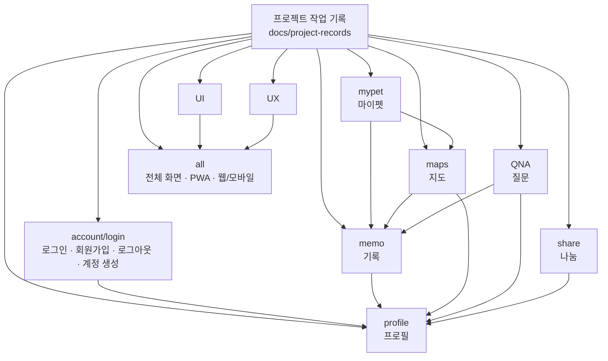

# 프로젝트 기록 연결 흐름

아래 파일은 사용자가 요청한 “파란색 박스처럼 화살표가 나오는 파일” 역할을 한다. 실제 앱 기능 코드는 아니며, 어떤 기록 파일이 어떤 영역을 담당하는지 한눈에 보기 위한 문서다.

## 기록 대상 파일

- UI: `UI.md`
- UX: `UX.md`
- account/login: `account-login.md`
- mypet: `mypet.md`
- memo: `memo.md`
- maps: `maps.md`
- QNA: `QNA.md`
- share: `share.md`
- profile: `profile.md`
- all: `all.md`

## 2026-07-03 기록

### 문제 인식

사용자는 기능별 기록 파일이 흩어져 있더라도 전체적으로 어떤 파일이 어떤 기능과 연결되는지 화살표 형태로 확인할 수 있는 문서를 원했다.

### 해결 과정

Mermaid flowchart를 사용해 프로젝트 기록 폴더에서 각 기능 기록 파일로 이어지는 구조와 기능 간 연결 관계를 문서화했다.

### 완료 기록

전체 기록 파일 연결 흐름 문서를 생성했다.

